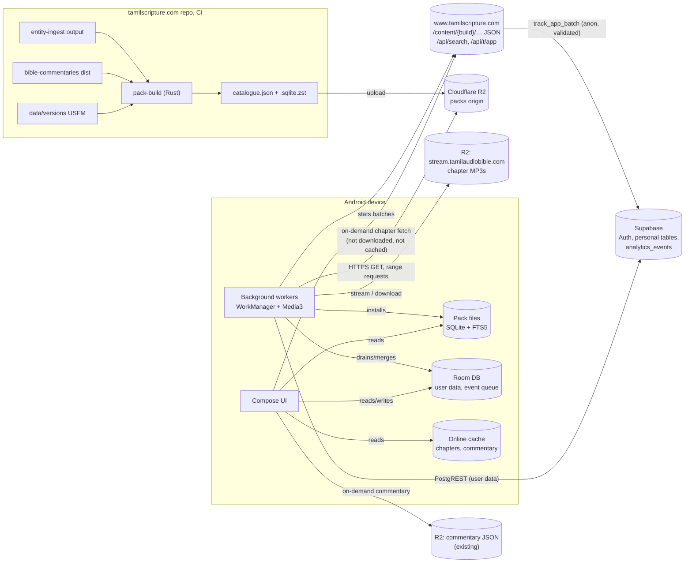
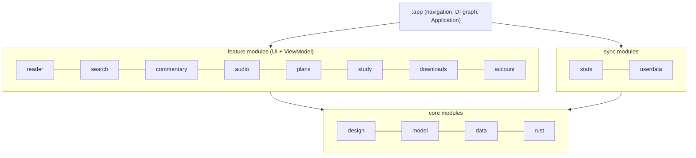
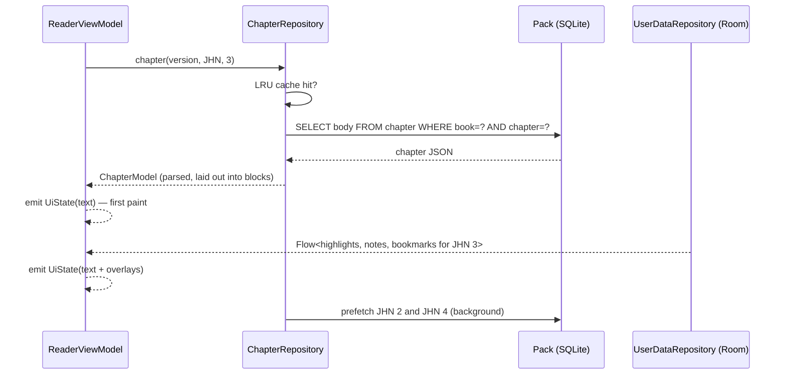
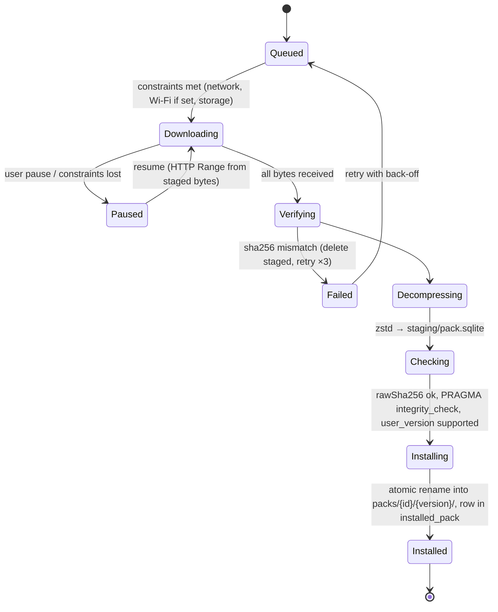
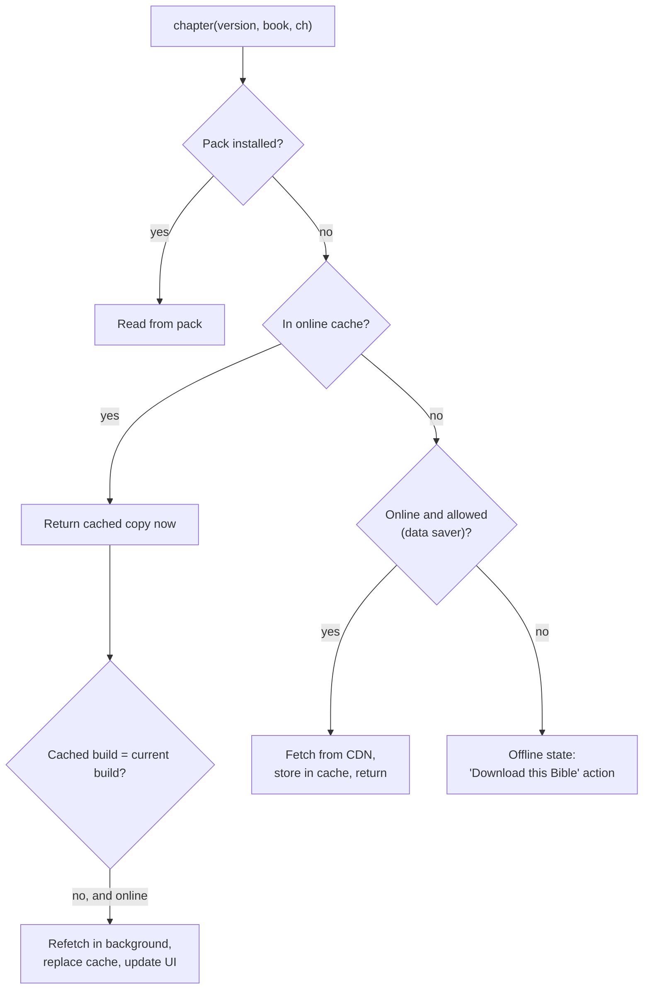
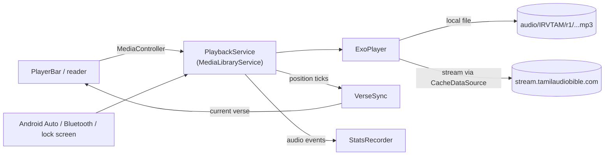
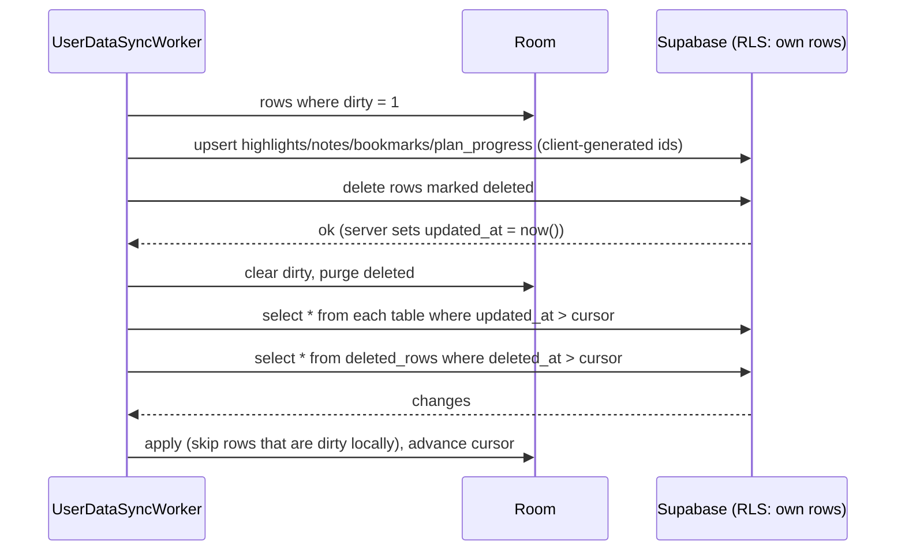
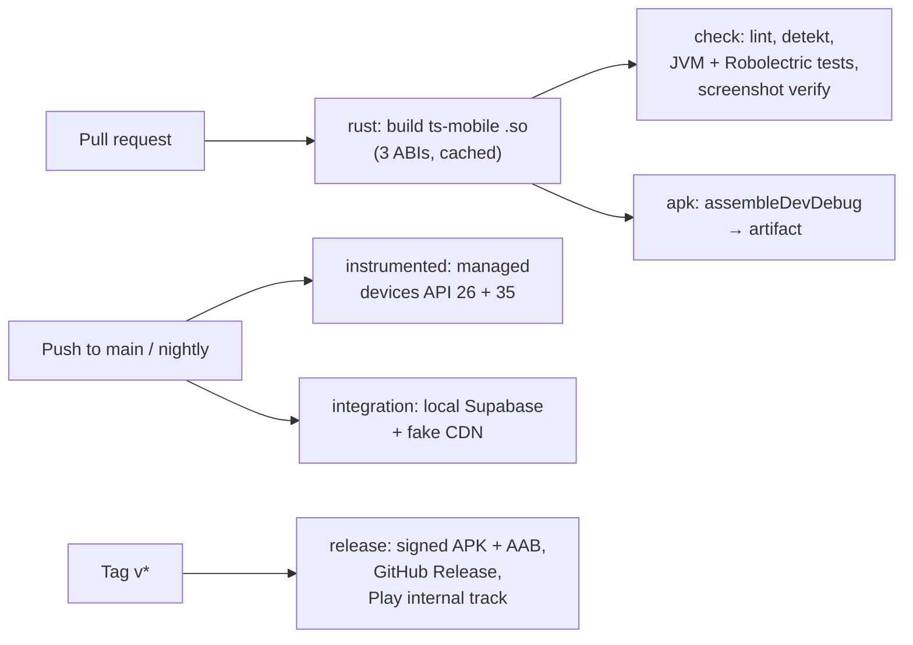

# Tamil Scripture Android App — Software Design

| | |
|---|---|
| Version | 0.1 draft, 3 October 2026 |
| Requirements | [requirements.md](requirements.md) |
| Plan | [roadmap.md](roadmap.md) |
| Website design it builds on | `tamilscripture.com/docs/design.md` |

The app is Kotlin and Jetpack Compose. Downloaded scripture lives in one SQLite file per pack. Content that is not downloaded is fetched chapter by chapter from the website's immutable content files and kept in an on-device cache. The UI always reads through one `ContentSource` that prefers packs, then the cache, then the network. Apart from that on-demand fetch, the network is used only by background work: pack downloads and updates, audio streaming, user-data sync and stats sync. The website's Rust crates are compiled into the app, so reference parsing and Tamil search behave exactly as they do on the web.

## Contents

1. [Principles](#1-principles)
2. [System context](#2-system-context)
3. [App architecture](#3-app-architecture)
4. [Adaptive layout](#4-adaptive-layout)
5. [Design system](#5-design-system)
6. [Reader](#6-reader)
7. [Content packs, online reading and downloads](#7-content-packs-online-reading-and-downloads)
8. [Search](#8-search)
9. [Shared Rust code](#9-shared-rust-code)
10. [Audio](#10-audio)
11. [Atlas and maps](#11-atlas-and-maps)
12. [Stats collection](#12-stats-collection)
13. [Accounts and sync](#13-accounts-and-sync)
14. [Performance and security](#14-performance-and-security)
15. [Testing](#15-testing)
16. [CI on GitHub Actions and release](#16-ci-on-github-actions-and-release)
17. [Decision records](#17-decision-records)
18. [Interim choices in the first build](#18-interim-choices-in-the-first-build)
19. [Open design questions](#19-open-design-questions)

---

## 1. Principles

1. **Scripture is local, people are remote.** The website's rule ("scripture is static; people are dynamic") carries over. Texts, commentaries, cross-references and study data are immutable files, downloaded as packs or fetched on demand and cached. Only personal data and stats travel to Supabase.
2. **Downloaded content never waits on the network.** A screen shows a loading state only when it is fetching content that is neither downloaded nor cached, or on the Downloads and sign-in screens.
3. **Local first, then cache, then network.** Every content read goes through `ContentSource`, which tries the installed pack, then the online cache, then the CDN. Callers do not know which one answered.
4. **One source of truth per concern.** Packs are built by the same Rust pipeline as the website. Parsing and normalisation come from the same Rust crates. Supabase schema changes go into the website repository's `supabase/migrations`.
5. **Layout by window, not by device.** Every screen decides its layout from the window size class and fold posture, re-evaluated on every resize.
6. **Text first, decorations after.** A chapter paints as soon as its text is available. Highlights, notes, audio position and community counts arrive afterwards as overlays and never delay the text.

---

## 2. System context



| System | Role for the app | Owned by |
|---|---|---|
| `bootstrap.json` on the website and on R2 | Names the host of every content origin (7.11) | New in this project |
| Cloudflare R2 `packs` bucket on a custom domain | Catalogue and pack files, immutable URLs | New in this project |
| Cloudflare R2 `ts-audio` (`stream.tamilaudiobible.com`) | Chapter MP3s, already used by the website | Website |
| Supabase (Postgres 16) | Auth, highlights, notes, history, plan progress, profiles, analytics (written through `/api/t/app`) | Website; the app adds migrations |
| Website static content `/content/{build}/…` | On-demand chapter, cross-reference and audio-timing JSON for online reading | Website |
| Website API `/api/search` | Online search when a version is not downloaded | Website |
| Website API `/api/t/app` (new) | Stats collector: adds geo from Vercel headers, forwards to Supabase | Website; added by this project |
| Cloudflare R2 commentary (`{base}/latest.json`, `{base}/{version}/…`) | On-demand commentary for online reading | Commentary repo |
| Website | Shared links open there; staff report `/mod/traffic` shows app stats | Website |

---

## 3. App architecture

### 3.1 Layers



- **UI layer.** Compose screens with one `ViewModel` each, exposing a single immutable `UiState` via `StateFlow`. Events go up as method calls; no shared mutable state.
- **Domain/data layer.** Repositories in `:core:data` hide where data comes from: `PackRepository`, `ChapterRepository`, `SearchRepository`, `CommentaryRepository`, `UserDataRepository`, `PlanRepository`, `CatalogueRepository`. They return `Flow`s and suspend functions and run on `Dispatchers.IO`.
- **Platform layer.** SQLite connections, Room DAOs, DataStore, Media3, WorkManager, supabase-kt.

### 3.2 Modules

| Module | Contents | Depends on |
|---|---|---|
| `:app` | `MainActivity`, `TsApplication`, top-level navigation, Hilt graph, App Links, keyboard shortcut registry | all features, sync |
| `:core:model` | Pure Kotlin types: `VerseId`, `Reference`, `Chapter`, `Block`, `Pack`, `Highlight`, `Note`, `Event` | — |
| `:core:design` | Theme, tokens, typography, bundled fonts, shared components (chips, sheets, verse action bar, pane divider) | model |
| `:core:rust` | UniFFI bindings to `ts-mobile` (`bible-ref`, `tamil-norm`, romanised Tamil) and the `.so` files | model |
| `:core:data` | Pack registry and SQLite access, Room database, DataStore, repositories | model, rust |
| `:core:testing` | Fakes, test packs, screenshot test rules | model, data |
| `:feature:reader` | Reader screen, formats, dual view, verse selection, settings sheet | core |
| `:feature:search` | Search box, results, filters | core |
| `:feature:commentary` | Commentary pane and inline cards | core |
| `:feature:audio` | `PlaybackService`, player bar, queue, verse sync | core |
| `:feature:study` | Cross-references, Strong's, places, persons, dictionary, atlas and maps (section 11) | core |
| `:feature:plans` | Today, Browse, Stats screens, reminder | core |
| `:feature:downloads` | Onboarding, catalogue screen, download workers | core |
| `:feature:account` | Sign-in, notes list, highlights list, history, export and delete | core |
| `:sync:stats` | Event recorder, Room queue, `StatsSyncWorker` | core |
| `:sync:userdata` | Outbox, pull/push `UserDataSyncWorker` | core |
| `:benchmark` | Macrobenchmark and Baseline Profile generator | app |

Feature modules never depend on each other. Cross-feature navigation uses typed routes defined in `:core:model`.

### 3.3 Technology choices

| Concern | Choice |
|---|---|
| Language | Kotlin 2.x, coroutines, Flow, kotlinx.serialization |
| UI | Jetpack Compose, Material 3, `material3-adaptive`, `material3-adaptive-navigation-suite` |
| Navigation | Navigation 3 (`NavDisplay`, serializable `NavKey` routes, view models scoped per entry) |
| DI | Constructor injection through one `AppGraph` built in the Application (no Hilt): no reflection or code generation at start-up |
| SQLite | `androidx.sqlite:sqlite-bundled` (`BundledSQLiteDriver`) for packs and Room. Ships its own current SQLite with FTS5 and the trigram tokenizer on every API level |
| User database | Room 2.7+ on the bundled driver |
| Settings | DataStore (Proto) |
| Background work | WorkManager |
| Audio | Media3 ExoPlayer, `MediaLibraryService`, `SimpleCache` |
| Network | `HttpURLConnection` for static JSON and packs (no networking library shipped); supabase-kt arrives with accounts (M6) |
| Sign-in | Credential Manager (Google ID token) + Supabase `signInWithIdToken`; email magic link via App Link |
| Shared logic | Rust + UniFFI, built with `cargo-ndk` |
| Maps | Compose renderer or MapLibre Native with Android-drawn labels, decided by a test in M8 (11.5, ADR-12) |
| Testing | JUnit 5, Turbine, Robolectric, Compose UI tests, Roborazzi screenshots, Macrobenchmark |
| Crash reporting | Self-hosted Sentry or Play Console vitals only (see NF-11) |

---

## 4. Adaptive layout

### 4.1 Window classes to layouts

`MainActivity` computes `currentWindowAdaptiveInfo()` (width class, height class, fold posture) and passes it down. Nothing reads `Configuration.screenLayout` or checks "is tablet".

| Width class | Navigation | Reader screen | Commentary / study | Book picker |
|---|---|---|---|---|
| Compact < 600 dp | Bottom bar (`NavigationSuiteType.NavigationBar`) | Single pane | Modal bottom sheet; inline cards for commentary | Full-screen picker |
| Medium 600–839 dp | Navigation rail | Main pane | Supporting pane (≈ 40%), hidden by default | Dialog |
| Expanded 840–1199 dp | Navigation rail | Main pane | Supporting pane, shown when a tool is open, draggable divider | Dialog |
| Large ≥ 1200 dp, Extra-large ≥ 1600 dp | Permanent drawer | Centre pane, max text width 72 ch | Right supporting pane, always available | Left list pane (book rail), always visible |

Top-level destinations: **Read**, **Search**, **Plans**, **Library** (downloads, highlights, notes, bookmarks, history), **Settings**.

The reader uses `SupportingPaneScaffold`. On large windows it is nested inside a list pane for the book rail. Pane state is held in `ThreePaneScaffoldNavigator`, so system back closes the supporting pane before leaving the chapter.

### 4.2 Pane contents

The supporting pane hosts one tool at a time, chosen from tabs: **Commentary**, **Cross-references**, **Study** (places, persons, static chapter map that opens the atlas, section 11), **Original words**, **Notes**, **Second version**. Dual view at medium and wider sizes is not a pane: it is two columns inside the main pane, so both columns share one scroll state (see 6.5).

### 4.3 Fold postures

`WindowInfoTracker.windowLayoutInfo` provides `FoldingFeature`.

- **Tabletop** (horizontal hinge, half-opened): reader above the hinge; player and verse action bar below it.
- **Book** (vertical hinge): main pane on one side, supporting pane on the other, the divider snapped to the hinge.
- **Separating hinge on a flat device:** content never straddles it; the divider snaps to its bounds.

### 4.4 Keyboard, mouse, stylus

| Input | Design |
|---|---|
| Shortcuts | One `ShortcutRegistry` in `:app` maps key chords to actions per screen; handled in `onPreviewKeyEvent` at the root. The registry also feeds `onProvideKeyboardShortcuts` so Meta+/ shows the system shortcut helper, and Ctrl+/ shows the same list in-app. |
| Focus | Every interactive element is focusable in a logical order; verses are focusable in Standard and Study formats so arrow keys move the selection. |
| Context menu | Secondary click on a verse opens the same actions as the verse action bar, via `pointerInput` detecting `PointerButton.Secondary`. |
| Hover | `hoverable` states on chips, verse numbers and cross-reference markers; on large windows hovering a cross-reference shows a preview card [R-7.5]. |
| Scroll | Mouse wheel scrolls; Ctrl+wheel changes font size step. |
| Drag and drop | `dragAndDropSource` on a selection produces `ClipData` text: the verses plus reference and version. |
| Stylus | `pointerInput` with `PointerType.Stylus`: a stroke over text selects the verses it crosses and applies the current highlight colour. |

### 4.5 Multi-window and state

- `android:resizeableActivity="true"`, no `screenOrientation`, no `maxAspectRatio`.
- "Open in new window" starts `MainActivity` with `FLAG_ACTIVITY_NEW_TASK | FLAG_ACTIVITY_MULTIPLE_TASK | FLAG_ACTIVITY_LAUNCH_ADJACENT` and a route; the manifest declares `PROPERTY_SUPPORTS_MULTI_INSTANCE_SYSTEM_UI`.
- Each window has its own navigation stack and reader state. Settings, user data and the audio session are shared through singletons in the application scope.
- Reader position (verse anchor + pixel offset), selection and open pane survive configuration changes through `SavedStateHandle`; no `configChanges` overrides.

---

## 5. Design system

The app uses the website's tokens (`apps/web/src/app.css`) as a custom Compose theme layered on Material 3. Material's dynamic colour is off: the warm-paper identity is part of the product.

### 5.1 Colour tokens

| Token | Light | Dark | Use |
|---|---|---|---|
| `bg` | `#FBF7F0` | `#1B1D22` | Page ground ("warm paper" / "night slate") |
| `surface` | `#FFFFFF` | `#262930` | Cards, inputs, chips |
| `surface2` | `#F3EDE2` | `#20232A` | Inset panels, card headers |
| `surface3` | `#EFE8DC` | `#2E323B` | Segmented-control track |
| `rail` | `#F7F2E8` | `#20232A` | Book rail on large windows |
| `ink` | `#191512` | `#F1ECE1` | Primary text, Tamil scripture |
| `ink2` | `#57504A` | `#C4BEB1` | Secondary text |
| `inkEn` | `#2A241E` | `#D8D2C6` | English scripture |
| `muted` | `#6B6259` | `#B0AA9D` | Captions, kickers |
| `line` / `line2` | `#E5DCCF` / `#DED3C4` | `#2E323B` / `#3A3F4A` | Dividers / control borders |
| `accent` | `#2B5B8C` | `#D9B25C` | The single accent: links, selection, active states |
| `onAccent` | `#FFFFFF` | `#262930` | Text on accent |
| `accentSoft` | `#EEF3F8` | `rgba(217,178,92,0.14)` | Tinted selection surface |
| `amber` | `#A2600F` | `#E39A5F` | Section headings, words of Jesus (`wj`) |
| `hl` | `#FBEFD3` | `#3B3420` | Selected verse, search match |
| `hlYellow` | `#F9E7A6` | `#6E6224` | Highlight |
| `hlGreen` | `#CFE6C2` | `#2F4F2C` | Highlight |
| `hlBlue` | `#C9DCF2` | `#29405A` | Highlight |
| `hlPink` | `#F4CBD8` | `#5A2E3C` | Highlight |
| `good` / `warn` / `bad` | `#2F7D4F` / `#8A6100` / `#B3261E` | `#8FCB9B` / `#E39A5F` / `#F0A9A9` | Status |

Tokens live in `TsColors` (an `@Immutable` data class) provided by `LocalTsColors`, and are also mapped onto `MaterialTheme.colorScheme` so stock components look right.

### 5.2 Typography

- **Bundled fonts** (in `:core:design/res/font`, subset to Tamil + Latin used by the corpus): Mukta Malar 400/600 (default Tamil), Noto Sans Tamil 400/600, Noto Serif Tamil 400/600, Noto Sans 400/600 (UI and English).
- **Scripture size steps:** 5 steps, default step 3 = 17 sp, matching the site. Steps are 15, 16, 17, 19, 21 sp, multiplied by the system font scale.
- **Line height:** 1.55 default, 1.4–1.9 adjustable.
- Tamil text uses `LocaleList("ta-IN")` on its `TextStyle` so TalkBack picks the Tamil voice; English uses `en`.
- `PlatformTextStyle(includeFontPadding = false)` and `LineHeightStyle` trimming keep Tamil vowel signs from clipping.

### 5.3 Shape and spacing

- Radii: 8, 12, 16, 18, 22 dp (`r-s` … `r-2xl`). Borders 1.5 dp.
- Spacing on a 4 dp grid. Minimum touch target 48 dp (the site's chips are 42 px; the app rounds up).
- Elevation is used sparingly: sheets and menus only, using the site's shadow values.

### 5.4 Components

| Component | Notes |
|---|---|
| `TsChip` | Site `.chip`: 1.5 dp `line2` border, 11 dp radius, Tamil semibold label |
| `VerseActionBar` | Floating bar above the selection (compact) or docked in the pane header (expanded) |
| `PaneDivider` | Draggable, keyboard-adjustable, snaps to 33/50/67% and to a hinge |
| `PlayerBar` | Docked at the bottom on compact; in the navigation rail footer on medium+ |
| `ReferenceBox` | Text field + suggestion list fed by `bible-ref` |
| `ProvenanceBadge` | AI draft / community-corrected / owner-authored / English source |

### 5.5 Iconography and motion

Material Symbols Rounded, weight 400. Motion follows Material 3 standard easing; chapter swipes use a pager; pane open/close uses the adaptive scaffold's built-in transitions. "Reduce motion" (animator duration scale 0) disables non-essential animations.

---

## 6. Reader

### 6.1 Loading a chapter



- The pack stores the website's chapter JSON unchanged (same `usfm-ingest` output): blocks of headings, paragraphs and poetry, verses with notes, `wj` spans, bridges, prev/next. One indexed row read is about 1 ms; parsing with kotlinx.serialization is 2–5 ms.
- `ChapterRepository` keeps an LRU of 12 parsed chapters and prefetches the neighbours of the current chapter.
- The parsed model is turned into a `ChapterUi`: a list of `BlockUi` items, each holding an `AnnotatedString` with verse-number `LinkAnnotation`s, footnote callers, cross-reference markers and `wj` spans. This is computed once per (chapter, format, toggles) and cached.

### 6.2 Rendering

- `LazyColumn` with one item per block (Reader and Standard formats) or per verse (Study Bible format). Items have stable keys (`JHN.3.para.4`, `JHN.3.16`).
- **Highlights** are drawn as background spans merged into the `AnnotatedString` from the overlay flow. Word-range highlights use character offsets on the specific version's text, as the website stores them.
- **Selection** is a set of verse IDs in the ViewModel; selected verses get the `hl` background.
- **Notes** show as a marker after the verse; on expanded windows with margin notes on, a `Layout` places note cards in a right margin aligned to their verse's first line (via `TextLayoutResult.getBoundingBox`).
- **Chapter paging:** `HorizontalPager` over a global chapter index (1–1,189), so swipe crosses book boundaries. Only the visible page and its neighbours are composed.
- Formats and paratext toggles change the `ChapterUi` builder's inputs, not the data. Switching keeps the anchor verse (6.4).

### 6.3 Formats

| Format | Items | Verse numbers | Headings | Cross-references | Footnotes |
|---|---|---|---|---|---|
| Reader | Paragraph and poetry blocks | Hidden; shown faintly on long-press | Toggle | Off | Off |
| Standard | Paragraph and poetry blocks | Superscript links | On by default | Markers → pane/sheet | Markers |
| Study Bible | One item per verse, cross-references inline below | Leading, bold | On | Inline, top 3, expand | Markers |

### 6.4 Position and history

- **Anchor:** the first verse whose top is at or below the viewport top, plus pixel offset into it. Stored in `SavedStateHandle`, in the in-app back stack entry, and (debounced 1 s) in DataStore as "last read".
- **Back stack:** each passage navigation pushes a typed route `Read(version, book, chapter, verse?)` with its anchor. Display changes do not push. Predictive back shows the previous passage.

### 6.5 Dual view

- **Now:** rows are aligned by verse number, exactly as the website's `DualChapter` does, so a verse only one version has lands in place with a dash on the other side. All current versions share the English versification, so this is exact for them.
- **Later:** a `VersificationMap` (shipped in Bible packs as a table `versification(from_id, to_id)`) aligns verses of version B to version A, for versions whose numbering differs.
- The Bible always opens in one column. A compare button in the reader's top bar turns two columns on and off for that reader only; it uses the version last compared with (the setting `compare`), asking the first time. A website link naming two versions (`/irvtam+kjv/…`) opens that reader compared. Dual view replaces the commentary pane and inline commentary, as on the website; a second version that cannot load (offline, not downloaded, or missing the book) falls back to one column, and switching keeps the verse at the top in place.
- The reader builds a list of rows `(blockA?, blockB?)` per verse in Study-like layout. On medium+ windows a row is a two-column `Row` inside one `LazyColumn`, so both columns scroll together without synchronising two lists. On compact windows the row becomes two stacked items (A then B).
- A missing verse produces an empty cell with a dash and an explanatory footnote [R-9.4].

### 6.6 Verse-read tracking (for stats)

- `VisibleVerseTracker` observes `LazyListState.layoutInfo` via `snapshotFlow`, sampled at most every 250 ms while the app is resumed.
- For paragraph items, per-verse bounds come from `TextLayoutResult` (verse start/end offsets → line tops/bottoms), cached per layout.
- A verse becomes "read" when ≥ 60% of its height has been inside the viewport continuously for ≥ 2 s. Each verse fires once per chapter visit. The tracker emits `Event.Read(verseId, version, dwellMs)` to the stats recorder (section 11).
- The thresholds are remote-config values in the catalogue (`stats.read.minVisible`, `stats.read.minMs`) so they can change without a release.

---

## 7. Content packs, online reading and downloads

### 7.1 Pack types

| Type | ID pattern | File | Notes |
|---|---|---|---|
| Bible | `bible.IRVTAM` | `bible.IRVTAM.v{n}.sqlite.zst` | Text, paratext, intros, versification, FTS |
| Cross-references | `xref` | `xref.v{n}.sqlite.zst` | OpenBible + `\x` merged, ordered by votes |
| Commentary | `commentary.henry` (also `calvin`, `geneva`, `poole`, `trapp`; the Early Church Fathers are excluded for now) | `commentary.henry.v{n}.sqlite.zst` | Units keyed by verse ranges, EN + TA |
| Study | `study.places`, `study.persons`, `study.dictionary`, `study.strongs`, `study.original`, `study.maps` | one SQLite each | Split so users take only what they want |
| Audio index | `audio.IRVTAM.r1.index` | small SQLite | Per-chapter duration, bytes, sha256, verse timings |
| Audio book | `audio.IRVTAM.r1.JHN` | directory of MP3s | Downloaded file by file; listed in the audio index |

### 7.2 Pack build pipeline

A new Rust crate, `pack-build`, lives in the website repository next to `usfm-ingest` and `entity-ingest`, so packs and website content come from the same build.

1. Input: the same build outputs the website uses (chapter JSON, search CSV, cross-reference JSON, entity output) plus the commentary repository's `dist/commentary/{version}`.
2. For each pack: create SQLite with `rusqlite` (bundled, FTS5 enabled), write tables, fill FTS tables with text normalised by `tamil-norm`, run `INSERT INTO fts(fts) VALUES('optimize')`, `VACUUM`, `PRAGMA page_size=4096`, set `PRAGMA user_version` = schema version.
3. Compress with zstd level 19 (long mode), compute SHA-256 of both the compressed and the raw file.
4. Write `catalogue.json`, sign it (Ed25519; the public key is compiled into the app), upload packs under immutable paths, then upload the catalogue last.
5. Determinism test: two runs give identical bytes.

CI job: `packs.yml` in the website repo, triggered when content, commentary version or `pack-build` changes.

### 7.3 Bible pack schema

```sql
CREATE TABLE meta (key TEXT PRIMARY KEY, value TEXT NOT NULL);
-- pack_id, pack_version, schema, version_code, language, name_ta, name_en,
-- licence, attribution, source_url, build_id, has_audio

CREATE TABLE book (
  code TEXT PRIMARY KEY,           -- 'JHN'
  ord INTEGER NOT NULL,            -- canonical order
  testament TEXT NOT NULL,         -- 'OT' | 'NT'
  name TEXT NOT NULL,              -- name in this version's language
  chapters INTEGER NOT NULL,
  intro TEXT                       -- book introduction JSON, nullable
);

CREATE TABLE chapter (
  book TEXT NOT NULL, chapter INTEGER NOT NULL,
  body TEXT NOT NULL,              -- website chapter JSON, unchanged
  PRIMARY KEY (book, chapter)
) WITHOUT ROWID;

CREATE TABLE verse (
  id INTEGER PRIMARY KEY,          -- book_ord*1000000 + chapter*1000 + verse
  book TEXT NOT NULL, chapter INTEGER NOT NULL, verse INTEGER NOT NULL,
  text TEXT NOT NULL               -- plain text for results and previews
);

CREATE TABLE versification (from_id INTEGER, to_id INTEGER);  -- to the shared map

-- word search over normalised text; rowid = verse.id
CREATE VIRTUAL TABLE verse_fts USING fts5(
  norm, content='', contentless_delete=1, tokenize='unicode61 remove_diacritics 0'
);
-- No trigram index: it would grow a Tamil pack from 4.7 MB to 12.4 MB (measured 3 Oct 2026);
-- misspelling-tolerant search goes to the website when online (§8.3).
```

Book names in both scripts, slugs and abbreviations are not in packs: they come from `books.toml`, compiled into the `bible-ref` crate.

### 7.4 Other pack schemas (summary)

| Pack | Main tables |
|---|---|
| Cross-references | `xref(from_id, to_start_id, to_end_id, votes, source)` with index on `from_id` |
| Commentary | `unit(id, start_id, end_id, lang, body_json, provenance)`, `meta`; index on `(start_id, end_id)`; `unit_fts` for search inside commentary (later) |
| Strong's | `lexicon(num, lemma, translit, pos, gloss_en, gloss_ta, definition)`, `occ(num, verse_ids BLOB)` (delta-encoded, as the website), `original(book, chapter, body_json)` |
| Places / persons | `entity(slug, kind, name_en, name_ta, body_json)`, `mention(slug, verse_id)`, `entity_fts` |
| Dictionary | `article(id, source, title_en, title_ta, paragraphs_json, licence)`, `article_fts` |
| Maps | See 11.2: projected geometry at three detail levels, places, journeys, polities, church, static chapter maps |
| Audio index | `chapter(book, chapter, ms, bytes, sha256, url)`, `timing(book, chapter, verse, start_ms)` |

### 7.5 Catalogue

The catalogue is found through the bootstrap file (7.11). It is served with a 5-minute cache, next to `catalogue.json.sig`. Every location in it is a **path**, resolved against an origin from the bootstrap file. No host name appears in the catalogue.

```json
{
  "schema": 1,
  "generated": "2026-10-03T06:00:00Z",
  "minApp": 1,
  "config": { "stats.read.minVisible": 0.6, "stats.read.minMs": 2000 },
  "content": { "manifest": "content/manifest.json" },
  "commentary": { "pointer": "commentary/latest.json" },
  "packs": [
    {
      "id": "bible.IRVTAM", "type": "bible", "lang": "ta",
      "version": 3, "schema": 1, "minApp": 1,
      "title": { "ta": "இண்டியன் ரிவைஸ்டு வெர்ஸன்", "en": "Indian Revised Version" },
      "licence": "CC BY-SA 4.0", "attribution": "© 2017, 2019 Bridge Connectivity Solutions",
      "path": "packs/bible.IRVTAM/3/bible.IRVTAM.sqlite.zst",
      "size": 5120000, "rawSize": 31000000,
      "sha256": "…", "rawSha256": "…",
      "starter": true
    }
  ]
}
```

The app only follows paths from a catalogue whose signature verifies.

### 7.6 Storage layout

```
filesDir/
  packs/
    bible.IRVTAM/3/pack.sqlite       ← installed, opened read-only
    commentary.henry/2/pack.sqlite
  staging/                           ← partial downloads and decompression
externalFilesDir (or chosen volume)/
  audio/IRVTAM/r1/JHN/JHN_003.mp3
```

Room table `installed_pack(id, version, path, size, installed_at, pinned)` is the source of truth for what is installed. `PackRegistry` opens one read-only `SQLiteConnection` per installed pack on first use (`PRAGMA query_only=1`, `mmap_size=64MB`) and closes idle connections after 5 minutes.

### 7.7 Download and install



- `PackDownloadWorker` is a `CoroutineWorker` running as a foreground service with type `dataSync` and a progress notification. One worker per pack, unique work name `pack:{id}`, at most 2 in parallel.
- Free space is checked before starting (`StorageManager.getAllocatableBytes`), requiring compressed + raw size + 10%.
- **Update:** the new version installs alongside the old; the registry switches atomically; the old directory is deleted when no connection uses it. Updates are automatic (7.10).
- **Audio** downloads are a series of per-chapter file downloads under one worker per book, verified against the audio index's sha256.

### 7.8 Onboarding

1. Interface language (Tamil default if the device locale is Tamil).
2. Starter set preselected from catalogue `starter: true` (IRVTAM, BSB, cross-references), with sizes and a Wi-Fi-only switch.
3. The reader opens at once at John 1 (or the deep-linked passage), reading online while the starter set downloads. When IRVTAM finishes installing, the reader switches to the pack silently.
4. "Skip downloads" leaves the user on online reading only.

If the device is offline on first run, nothing can be shown, because no scripture is bundled. The app shows a retry screen that explains a connection is needed once.

### 7.9 Online reading

Online reading reuses the website's static content, which is already built per chapter, immutable and edge-cached. Each chapter file is the same JSON that Bible packs store (ADR-4), so one parser serves both. Today the `content` origin is the website on Vercel; it can move to R2 without an app release (7.11).

| Content | Path on the `content` origin (7.11) | Cache lifetime on the server |
|---|---|---|
| Content manifest (names the current build) | `content/manifest.json` | Short (minutes) |
| Chapter | `content/{build}/{VERSION}/{BOOK}/{ch}.json` | Immutable |
| Audio verse timings | `content/{build}/{VERSION}/{BOOK}/{ch}.audio.json` | Immutable |
| Cross-references | `content/{build}/xref/{BOOK}/{ch}.json` | Immutable |
| Commentary (`commentary` origin) | `commentary/latest.json`, then `commentary/{version}/{source}/…` | Pointer 5 min, files immutable |
| Search (`api` origin, always the website) | `api/search?q=&v=&offset=` | Not cached |

**`ContentSource` resolution**



- **Online cache:** a Room-managed SQLite file `online_cache(kind, key, build, body, size, last_used)`, where `key` is the content path, never a URL, so a host change keeps the cache, with `kind` one of chapter, xref, commentary or timing. LRU eviction over a 50 MB default budget, adjustable in Settings. The app keeps at least the last 200 chapters whatever their size. Packs are never counted or evicted.
- **Fetching:** Ktor with HTTP/2 and gzip/brotli. Timeouts: 4 s connect, 8 s total. One retry. Requests for the same key are coalesced.
- **Prefetch:** while reading online, the neighbouring chapters (±1) are fetched after the current one paints. On Wi-Fi the next 3 chapters are fetched.
- **Speed target (ON-4):** a cold fetch is one HTTPS request to Vercel's Mumbai edge, about 100–300 ms on 4G, plus about 5 ms to parse.
- **Search** when the version is not downloaded calls `/api/search` and maps the response into the same result model. The Tamil folding is identical because the server uses the same crate.
- **Download suggestion (ON-6):** a counter per version in DataStore. At 10 online chapters the app shows a snackbar once: "Download IRV for offline (5 MB)".
- **Stats:** `view` and `read` events carry `source: pack | cache | online`.

### 7.10 Keeping content up to date

| What | How the app learns it changed | What happens |
|---|---|---|
| Installed packs | The catalogue lists a higher `version` for the pack | `CatalogueRefreshWorker` runs daily and on app start (at most every 6 h). For each outdated pack it enqueues `PackDownloadWorker` with the auto-update constraints: unmetered network by default, any network if the user allows. Install is atomic (7.7). A "Recently updated" list on the Downloads screen shows what changed. |
| Online-cached chapters | `manifest.json` names a new `build` | The cached copy is shown at once. If its `build` differs from the current one, it is refetched in the background and the open screen updates in place if the text changed (stale-while-revalidate). |
| Online-cached commentary | `latest.json` names a new version | Same as chapters. |
| Catalogue config | `generated` timestamp | Applied immediately (for example, stats thresholds or content base URLs). |

User data is keyed by book, chapter and verse numbers, so any update leaves highlights, notes and bookmarks attached.

### 7.11 Changing hosts (R2 ↔ Vercel)

Content will start split: chapter JSON on the website (Vercel), packs, commentary and audio on Cloudflare R2. Moving any of them later, in either direction, must not need an app release or break installed apps.

#### What a late change costs

The expensive part of a late change is installed apps, not the data copy. Android users update slowly, so any host compiled into a released app has to keep working for years.

| Change made late | Cost **without** this design | Cost **with** this design |
|---|---|---|
| Move chapter JSON Vercel → R2 | New app release; old versions keep hitting Vercel until they die out; the web needs code changes | Upload to R2, change one origin in `bootstrap.json`. No app release. The web needs only its `PUBLIC_CONTENT_BASE` setting if it is prepared (7.11.5). |
| Move packs R2 → Vercel (or another CDN) | Catalogue URL compiled into the app; every installed app breaks | Copy files, change the `packs` origin. Old apps follow the bootstrap file. |
| Move audio | Streamed-audio cache keyed by full URL, so every listener re-downloads | Cache keyed by path; nothing re-downloads |
| Provider outage | Reading of uncached content stops | The app tries the next origin in the list |
| Data copy itself | About 350 MB of JSON per build, a few GB of packs, about 10 GB of audio | Same. R2 has no egress fees, so copying out of R2 costs only Vercel-side storage and bandwidth. |

#### 7.11.1 Origins, not URLs

The app knows five named origins. Every content request is `origin + path`.

| Origin | Serves | Today | Can move to |
|---|---|---|---|
| `content` | Manifest, chapter, cross-reference, timing and entity JSON | Website on Vercel (`https://www.tamilscripture.com/`) | R2 |
| `packs` | Catalogue and pack files | R2 | Vercel or another CDN |
| `commentary` | Commentary pointer and JSON | R2 | Vercel |
| `audio` | Chapter MP3s | R2 (`stream.tamilaudiobible.com`) | Any CDN |
| `api` | Search, stats collector, auth callback | Website on Vercel | Stays with the website |

#### 7.11.2 Bootstrap file

`bootstrap.json` (+ `.sig`, signed with the same Ed25519 key as the catalogue) is the only thing the app finds by a fixed address. It is tiny, cached for 5 minutes, and lists each origin as an **ordered list** of base URLs:

```json
{
  "schema": 1,
  "origins": {
    "content":    ["https://www.tamilscripture.com/", "https://<r2-content-host>/"],
    "packs":      ["https://<r2-packs-host>/"],
    "commentary": ["https://<r2-commentary-host>/"],
    "audio":      ["https://stream.tamilaudiobible.com/"],
    "api":        ["https://www.tamilscripture.com/"]
  },
  "catalogue": "packs/catalogue.json"
}
```

- The app ships with **two** bootstrap addresses, one on each provider: `https://www.tamilscripture.com/app/bootstrap.json` (Vercel) and the same file on R2. It tries them in order and keeps the last good copy in DataStore. If either provider disappears, the app still starts.
- A copy of the last good bootstrap is also built into each release as a fallback for first runs during an outage.
- Origins are tried in list order. On a connection error or a 5xx, the request is retried once on the next base URL, and that origin is marked down for 10 minutes. A 404 is not retried elsewhere (content mistakes should surface, not hide).

#### 7.11.3 Same layout on every host

Every host serves the same path layout (the table in 7.9 and the `packs/…` paths in 7.5). The publishing scripts take a target, `vercel`, `r2` or both, and write identical trees. Moving a host is therefore "publish to the new target, check it, reorder the origin list, stop publishing to the old one later".

The app relies only on HTTP features both providers support for static files:
- `GET` with `Range` (download resume)
- `ETag` and `If-None-Match` for the manifest and pointers
- `Cache-Control: public, max-age=31536000, immutable` on versioned paths
- gzip or Brotli for JSON

It uses nothing provider-specific (no Vercel rewrites, no Cloudflare Workers) on the content path. **Integrity never depends on the host:** packs and the catalogue are verified by signature and SHA-256, so a mirror is as trusted as the original.

#### 7.11.4 Nothing stores a host

- The online cache, the audio cache and installed-pack records are keyed by path.
- User data, history and stats store verse IDs and paths, never URLs.
- Shared links always point to `www.tamilscripture.com` pages, which are not content URLs.

#### 7.11.5 Website side (prepared, not migrated)

The website is not changing now. Two small, harmless preparations in the website repo would make a later move a configuration change there too:

1. `contentUrl()` in `apps/web/src/lib/content/manifest.ts` reads `PUBLIC_CONTENT_BASE`, defaulting to `''` (same origin, today's behaviour).
2. The service worker matches content by path pattern on any allowed origin, not only same-origin `/content/`.

With those in place, moving the website's content to R2 later needs:
- an upload step in the deploy
- a CORS rule on the bucket
- a `preconnect` hint
- setting the variable

#### 7.11.6 Conformance test

`scripts/check-origin.sh <base-url>` (run in CI against every configured base URL, nightly) fetches a fixed sample:
- the manifest
- 20 chapters
- a pack with a `Range` request
- the catalogue and its signature
- an audio file with a `Range` request

It checks status codes, `Content-Type`, cache headers, Range support and SHA-256. A new host is added to `bootstrap.json` only after it passes.

---

## 8. Search

### 8.1 Why SQLite FTS5

One Bible is about 31,000 verses. An FTS5 inverted index answers word, prefix and phrase queries over that in well under 50 ms on a mid-range phone, with BM25 ranking and no extra storage engine. It lives inside the pack file, is built on the server, and needs no indexing on the phone. Android's own SQLite does not reliably include FTS5 or the trigram tokenizer, so the app uses the bundled SQLite driver everywhere (ADR-3).

### 8.2 Normalisation is shared

- At build time `pack-build` fills `verse_fts.norm` with `tamil_norm::normalise(text)` (Tamil) or lower-cased, Porter-stemmed text (English).
- At query time the app runs the same function on the query through `:core:rust`. Because both sides use the same Rust code, matching equals the website's Postgres search (whose SQL function is generated from the same crate).
- Romanised Tamil (`anbu`) is converted to Tamil script first. The website does this in `apps/web/src/lib/search/romanised.ts`; it is ported to Rust in `ts-mobile` so web and app can share it later.

### 8.3 Query pipeline

1. `bible-ref` parse. If the input is a reference, navigate; done.
2. Split quoted phrases from loose terms. Normalise each term.
3. Build an FTS5 `MATCH` expression: phrases as `"…"`, loose terms ANDed, the last term as a prefix (`term*`) while typing.
4. Query `verse_fts` in each selected pack, `ORDER BY rank LIMIT 50` per page, join to `verse` for text.
5. If the pack finds nothing and the device is online, the website's `/api/search` answers instead; it adds trigram similarity for misspellings. Packs carry no trigram index (it more than doubles their size).
6. Group by book in canonical order with counts (`SELECT book, count(*) … GROUP BY book` on the match set).
7. **Highlighting:** because the FTS tables are contentless, matched words are found in Kotlin: tokenise the original verse text, normalise each token with the same Rust function, and mark tokens equal to (or prefixed by) a query term.

Searching several versions runs the per-pack queries in parallel coroutines and merges by book order.

### 8.4 Other searches

- Book-name autocomplete: from `bible-ref`'s compiled tables, in memory.
- Recent searches: Room table `recent_search(query, at)`, max 50.
- Places, persons and dictionary: each study pack has its own FTS table; results appear in separate sections.
- Common searches: `GET /rest/v1/common_searches` (anon) when online, cached in DataStore for 24 hours.
- Versions that are not downloaded: `/api/search` on the website when online (7.9), shown with a small "online results" label.

---

## 9. Shared Rust code

| Crate | Source | Used for |
|---|---|---|
| `bible-ref` | Existing, website repo | Reference parsing, book names and abbreviations, Tamil numerals, bridges |
| `tamil-norm` | Existing, website repo | Search normalisation |
| `ts-mobile` | New, website repo `crates/ts-mobile` | UniFFI façade over the two crates plus romanised-Tamil conversion |
| `pack-build` | New, website repo `crates/pack-build` | Server-side pack builder (not shipped in the app) |

```rust
// ts-mobile, exposed with #[uniffi::export]
fn parse_reference(input: String, lang_hint: Lang) -> ParseResult;   // Ref | Suggestions | NotARef
fn format_reference(r: Reference, lang: Lang) -> String;
fn normalise_ta(text: String) -> String;
fn normalise_en(text: String) -> String;
fn tokens_ta(text: String) -> Vec<Token>;        // for highlighting matches
fn romanised_to_tamil(input: String) -> Option<String>;
fn book_suggestions(prefix: String, limit: u32) -> Vec<BookName>;
```

- Built with `cargo-ndk` for `arm64-v8a`, `armeabi-v7a`, `x86_64` in release mode with `lto = true`, `opt-level = "z"`, `strip = true`; target size < 1 MB per ABI.
- Gradle task `:core:rust:cargoBuild` runs before `merge*JniLibFolders`; CI caches the Rust target directory.
- The website's 500+ reference fixtures run against the Android build in an instrumented test, so parity is enforced on both platforms.

---

## 10. Audio

### 10.1 Components



- One `PlaybackService` per process. The UI connects with a `MediaController`; playback continues when the reader moves to another chapter [A-6.6].
- **Queue:** a `MediaItem` per chapter of the current book, built from the audio index (`mediaId = IRVTAM/r1/JHN/3`). Auto-continue moves to the next chapter and on to the next book.
- **URI resolution:** local file if downloaded and verified, else `{audio origin}/{VER}/{rec}/{BOOK}/{BOOK}_{ccc}.mp3` (today `https://stream.tamilaudiobible.com`) through `CacheDataSource` with a 256 MB LRU `SimpleCache`. A custom `CacheKeyFactory` keys the cache by the path only, so moving the audio host keeps what is already cached.
- **Without the audio index** (not downloaded yet), the first Play fetches the index pack (~0.6 MB) and continues.
- **Metadata:** title "யோவான் 3 · IRV", artist = narrator, artwork = app icon; `MediaLibrarySession` exposes Versions → Books → Chapters for Android Auto.
- **Speed and sleep timer:** `PlaybackParameters`; sleep timer as a coroutine that pauses at the time or at the end of the chapter.

### 10.2 Verse sync

- Timings come from the audio index table `timing` (from the website's `timings/{BOOK}.tsv`; alignment scores ≈ 0.95–0.97).
- While the reader is visible, `VerseSync` reads the player position every 200 ms, binary-searches the chapter's start times, and emits the current verse ID. The reader highlights it and, if "follow audio" is on, scrolls it into view.
- "Play from here" seeks to the verse's start (or the bridge's first verse). Chapters without timings fall back to the chapter start.
- Files are 64 kbit/s CBR, so seeks are exact.

### 10.3 Audio stats

Same actions as the website's A7: `play` (with `verse` when started from a verse), `next`, `jump`, `end`, and `time` (seconds actually listened, flushed on chapter change, pause, stop and service destroy). Each event also carries `offline=true/false`.

---

## 11. Atlas and maps

The atlas is the app's version of the website's `/atlas/explore`, `/atlas/{journey}` and `/place/{slug}` (website `docs/feature_maps.md`). It shows the same data and layers, works offline from the `study.maps` pack, and adapts to every window size. How the map is drawn is decided by a short test early in M8 (11.5, ADR-12). Everything else in this section is the same whichever renderer wins.

### 11.1 What it shows

| Layer | Content | Source (website build) | Default |
|---|---|---|---|
| Base map | Land, coastline, lakes, rivers: 1:10m over the biblical world, 1:110m world outline beyond it. No terrain, roads or modern borders. | Natural Earth (public domain) via `scripts/build-basemap.py` | Always on |
| Places | One dot per located place, size by mention count, label in the interface language | OpenBible geocoding + TIPNR, `entities/place/*` | On |
| Journeys | Routes with ordered stops; each journey has its own colour (8 hues) and dash pattern (4), as on the web | Project MARBLE routes (CC BY-SA) or straight legs | Off; one turned on when opened from a journey |
| Kingdoms | Historical polity borders for a chosen year, driven by a timeline slider (4000 BCE – AD 800) | Cliopatria (CC BY 4.0) | Off |
| Early church | One pin per city with fathers, councils and sees; councils marked | Wikidata roster | Off |

Every map shows its attribution line (OpenBible CC BY 4.0, Natural Earth, MARBLE CC BY-SA 4.0 when routes are shown, Cliopatria CC BY 4.0). Tamil names marked as drafts on the website carry the same "draft" badge in the app.

### 11.2 Data

The `study.maps` pack is built by `pack-build` from the website's entity output. Geometry is prepared on the server so the phone does no projection or simplification.

```sql
CREATE TABLE meta (key TEXT PRIMARY KEY, value TEXT NOT NULL);   -- bbox, projection, lod thresholds, attribution
CREATE TABLE layer_geom (                                      -- base map, journeys' routes, polities
  layer TEXT NOT NULL,          -- 'land' | 'coast' | 'lake' | 'river' | 'world' | 'route' | 'polity'
  feature_id TEXT NOT NULL,
  lod INTEGER NOT NULL,         -- 0 coarse, 1 medium, 2 full detail
  bbox_minx REAL, bbox_miny REAL, bbox_maxx REAL, bbox_maxy REAL,
  coords BLOB NOT NULL,         -- Web Mercator x/y as packed float32 pairs, rings/parts delimited
  PRIMARY KEY (layer, feature_id, lod)
) WITHOUT ROWID;
CREATE TABLE place (
  id TEXT PRIMARY KEY,          -- 'place/damascus'
  x REAL, y REAL,               -- projected
  kind TEXT, precision TEXT,
  name_en TEXT, name_ta TEXT, ta_draft INTEGER,
  rank INTEGER,                 -- 1 = most mentioned; drives label priority and dot size
  mentions INTEGER
);
CREATE TABLE journey (id TEXT PRIMARY KEY, name_en TEXT, name_ta TEXT, period TEXT, ord INTEGER,
                      hue INTEGER, dash INTEGER, bbox_minx REAL, bbox_miny REAL, bbox_maxx REAL, bbox_maxy REAL);
CREATE TABLE journey_stop (journey TEXT, seq INTEGER, place TEXT, passage TEXT, note_en TEXT, note_ta TEXT,
                           PRIMARY KEY (journey, seq));
CREATE TABLE polity (feature_id TEXT, name_en TEXT, name_ta TEXT, ta_draft INTEGER,
                     start_year INTEGER, end_year INTEGER, label_x REAL, label_y REAL);
CREATE TABLE church (id TEXT PRIMARY KEY, place TEXT, kind TEXT, year INTEGER, name_en TEXT, name_ta TEXT, links TEXT);
CREATE TABLE chapter_map (book TEXT, chapter INTEGER, light BLOB, dark BLOB, place_ids TEXT,
                          PRIMARY KEY (book, chapter)) WITHOUT ROWID;   -- the website's static WebP maps
CREATE VIRTUAL TABLE place_fts USING fts5(norm, content='', tokenize='unicode61');  -- names, both scripts, tamil-norm folded
```

- **Detail levels:** three Douglas–Peucker simplifications per shape (about 2 km, 500 m and full detail at the source scale). The renderer switches level as zoom crosses thresholds stored in `meta`.
- **Size:** the website's map data is about 20 MB raw. Packed float32 coordinates plus zstd are estimated at 5–8 MB to download. The static chapter maps are their own optional pack (`study.maps.chapters`) because they are the bulk.
- **Online:** when `study.maps` is not installed, `ContentSource` fetches the website's `entities/geo/…` GeoJSON and converts it on the device. This is slower to open the first time; the app then suggests downloading the pack.
- Place details (verses, related people, articles) come from `study.places` and the Bible pack, through the same repositories as the rest of the app.

### 11.3 Screens by window size

| Width | Layout |
|---|---|
| Compact (phone) | Full-screen map. Top: back, place search, layer chips (Places, Journeys, Kingdoms, Early church). Right edge: zoom in, zoom out, fit all. Bottom sheet with three heights: **peek** (selected place's name and kind, or "Journeys" when nothing is selected), **half** (details or the journeys list), **full** (all verses). The timeline slider docks above the sheet when Kingdoms is on. |
| Medium (foldable, small tablet) | Map plus a 360 dp side sheet for lists and details. **Tabletop posture:** map on the top half, sheet on the bottom half. **Book posture:** map and sheet on either side of the hinge. |
| Expanded and wider (tablet, ALOS) | Three panes: **journeys and layers** list on the left (grouped by period, checkbox plus line-style legend per journey, the church lists), **map** in the centre with the timeline under it, **details** on the right. Hovering a journey row emphasises its route and stops, as on the web. |

**Ways in:**
- Library → Atlas
- a place or journey in search results
- a place name in a verse's Study pane
- tapping the static chapter map (opens focused on that chapter's places)
- a journey's "Show on map"
- App Links from `www.tamilscripture.com/atlas/explore?journey=…|place=…|chapter=…`, `/atlas/{journey}` and `/place/{slug}`

**From the map to the text:** tapping a verse in the details opens the reader. On compact windows the reader replaces the atlas, and back returns to the same camera and selection. On expanded windows it opens in the supporting pane, or in a new window on ALOS (FF-9), so the map stays visible.

### 11.4 Interaction

**Camera.** State is `(centerX, centerY, zoom)` in projected units, held in `AtlasViewModel`, saved in `SavedStateHandle` and restored after rotation, fold or resize (FF-4).
- **Zoom range:** from the whole Mediterranean world down to about city scale. Further adds nothing with outline data.
- **Pan limits:** the pack's bounding box plus a margin.
- **Rotation and tilt:** off.

| Input | Action |
|---|---|
| Pinch | Zoom around the fingers' centre |
| Drag / fling | Pan, with decay animation |
| Double tap | Zoom in one step at that point |
| Two-finger tap | Zoom out one step |
| Double-tap and drag | One-finger zoom |
| Tap | Select the nearest place within 24 dp; tap empty sea or land to clear |
| Long press | Show the place name and kind in a tooltip without selecting |
| Mouse wheel / trackpad pinch | Zoom around the cursor |
| Mouse drag | Pan |
| Hover | Highlight the place or route under the cursor; preview its name |
| Right click | Context menu: Read verses, Show journeys here, Copy name |
| `+` / `−`, `Ctrl` + wheel | Zoom |
| Arrow keys | Pan by a quarter of the view |
| `Tab` / `Shift+Tab` | Move focus between labelled places in view, in rank order |
| `Enter` / `Esc` | Select the focused place / clear selection or close the sheet |
| `0` | Fit all |

**Camera animations** (300 ms, standard easing):
- selecting a journey fits its route's bounding box
- selecting a place from search or a list centres it, zooming in if it is below its label zoom
- "Fit all" returns to the pack's bounding box

The animation is skipped when "Reduce motion" is on.

**Labels.** Place labels appear by rank: at the widest zoom only the top ranks (Jerusalem, Rome, Babylon…), more as the user zooms in. Placement is greedy in rank order with collision boxes, so higher-ranked labels win and the rest show as dots only.
- The selected place and the stops of selected journeys always get labels.
- Polity labels sit at their stored `label_x/label_y` and give way to place labels.
- Labels are in the interface language. Tamil labels use the reader's chosen Tamil typeface; if a Tamil name is a draft, the label shows it with the draft badge in the details pane only (not on the map, to keep it clean).

**Selection and details.** Hit-testing uses a uniform grid index over projected place coordinates, rebuilt when the zoom level changes band. The details pane shows:
- the name in both scripts, kind and precision
- a mini locator when the map is zoomed far out
- verses that mention it, grouped by book (from `study.places`), each opening the reader
- related journeys (tapping one turns it on and fits it)
- related people and dictionary articles when those packs are installed

**Timeline (Kingdoms and Early church layers).**
- A slider with year labels; drag to change the year.
- The map shows polities whose `start_year ≤ year ≤ end_year` and church entries with `year ≤ year`.
- Keyboard: `[` and `]` step by decade, with `Shift` by century.
- The year is part of the saved camera state.

### 11.5 Rendering (decided by a test in M8; ADR-12)

Map engines such as MapLibre lay out label text one character at a time from pre-made glyph files. Tamil needs reordering and glyph substitution:
- prefix vowel signs (கொ is stored க + ொ but drawn ெ க ா)
- fused consonant–vowel shapes (து, கு, ரு)
- ligatures (ஸ்ரீ)

Setting `textFont("Noto Sans Tamil")` does not help: it names a font stack on a glyph server, not an Android font, and the layout is still per character. MapLibre's `localIdeographFontFamily` covers only Chinese, Japanese and Korean. The website hits the same problem and draws its labels as HTML markers. So whichever engine draws the shapes, **Tamil labels must be drawn by Android's own text stack**, which shapes them correctly.

The atlas is written against a small renderer interface so the choice stays cheap to change:

```kotlin
interface AtlasRenderer {
    @Composable fun Map(state: AtlasState, layers: LayerSet, onTap: (MapPoint) -> Unit, modifier: Modifier)
}
// AtlasState: camera, selection, visible layers, year — owned by AtlasViewModel, renderer-agnostic.
// Label placement (rank + collision) and hit-testing live in :feature:study, shared by both renderers.
```

| | **A. Compose renderer** (current preference) | **B. MapLibre Native + label images** | **C. MapLibre with `textFont`** |
|---|---|---|---|
| Shapes | `Canvas` drawing cached `Path`s per detail level; pan and zoom change one transform | MapLibre GeoJSON sources with fill and line layers, a local style JSON | Same as B |
| Labels | Compose `TextMeasurer` with bundled Tamil fonts, drawn in the same canvas | Bitmaps drawn by Android's text stack on demand (`OnStyleImageMissingListener` → `style.addImage`), placed by a symbol layer's `iconImage`; MapLibre handles collision | MapLibre text |
| Tamil correct | Yes | Yes | **No**, unless upstream adds full shaping |
| App size | No new native code | MapLibre native library, several MB per ABI; would ship as an on-demand feature module so the base app stays under NF-1 | Same as B |
| Strengths | Small, fully themed, same accessibility and input code as the rest of the app | GPU rendering for heavy polygons; mature gestures; style close to the website's MapLibre style | Simplest code |
| Risks | Polity polygons at full detail may be heavy on low-end phones | Label bitmaps redrawn on theme change; memory if many labels are created; feature-module delivery adds a first-open download | Wrong Tamil |

**The test (roadmap M8-0, about 2 days).** Build A and B behind `AtlasRenderer` with the real `study.maps` data and compare:

| Criterion | Pass mark |
|---|---|
| Tamil labels "கொரிந்து", "தமஸ்கு", "ஸ்ரீ", "எருசலேம்", "அந்தியோகியா" | Identical to the reader's text rendering |
| Pan and zoom with Kingdoms on, Pixel 6a | 60 fps, < 1% janky frames |
| Same on a 2 GB Android 8 phone | ≥ 45 fps, no out-of-memory |
| Atlas open, pack installed | < 500 ms to first frame |
| Extra memory with the atlas open | < 80 MB |
| Added to the base download | 0 MB for A; B only via an on-demand module |

Choose A if it passes. Choose B if A fails on frame rate and B passes everything else. Re-check option C only if MapLibre ships full complex-script shaping.

### 11.6 Static chapter maps

The Study pane (4.2) shows the website's pre-rendered chapter map (WebP, light or dark to match the theme) for chapters that name located places. The maps come from `study.maps.chapters`, or online through `ContentSource`. It is an image with no interaction. Tapping it opens the atlas focused on that chapter's places, the app's equivalent of the website's `?chapter=` link.

### 11.7 Accessibility

- Each labelled place currently in view is a semantics node ("Damascus, city, 61 verses") in rank order, so TalkBack users can swipe through the map's places.
- **List view** toggle: replaces the map with a list of places in view (or a selected journey's stops in order), each opening the same details.
- Zoom buttons, the timeline slider and every keyboard shortcut give full control without gestures.
- Journey colours are paired with dash patterns, so routes can be told apart without colour vision.
- Labels respect the font scale up to 1.5×. Beyond that the list view is offered, since map labels would collide.

### 11.8 Tests

- **Screenshot tests:** the atlas at each width class, light/dark and Tamil/English, with a fixed camera.
- **Label tests:** the five Tamil names above, compared with the reader's rendering of the same words.
- **Gesture and keyboard tests** with `performTouchInput` / `performKeyInput`: zoom limits, fit-to-journey, tap selection within 24 dp, `Tab` order.
- **Macrobenchmark** of a scripted pan/zoom with Kingdoms on, on the devices in 15.5.

---

## 12. Stats collection

### 12.1 In-app pipeline

```mermaid
flowchart LR
  A["Reader, player, search…"] -- "record(Event) — non-blocking" --> CH["Channel (capacity 1024,\nDROP_OLDEST)"]
  CH -- "batch every 2 s or 100 events" --> DB[("Room: pending_event")]
  DB --> W["StatsSyncWorker\n(network required)"]
  W -- "POST /api/t/app\n≤ 500 events" --> V["Vercel function\n(geo headers, JWT check)"]
  V -- "rpc track_app_batch\n(anon key)" --> SB[("Supabase")]
  SB -- "accepted ids" --> V
  V -- "accepted ids" --> W
  W -- "delete accepted" --> DB
```



- `StatsRecorder.record(event)` does `channel.trySend` only: no allocation beyond the event object, no I/O, well under 1 ms [ST-1].
- A collector coroutine in the application scope writes batches to Room in one transaction.
- `pending_event(id TEXT PK /*UUIDv7*/, kind TEXT, at INTEGER, payload TEXT /*JSON*/, attempts INTEGER)`.
- **Scheduling:** a unique periodic `StatsSyncWorker` every 15 minutes with `NetworkType.CONNECTED`; plus a one-time expedited run when 50+ events are pending or when the app goes to the background (`ProcessLifecycleOwner` `ON_STOP`). Exponential back-off from 30 s.
- **Retention:** after each write, delete beyond 10,000 rows or older than 30 days [ST-4].
- **Opt-out:** when off, the recorder drops events and the table is cleared [ST-8].
- Debug builds have a "Stats" screen listing pending events and the last sync response [ST-10].

### 12.2 Payload

```json
{
  "install": "0b8e…",              // random UUID from first run, DataStore
  "app": "1.0.0 (12)", "device": "tablet", "window": "expanded",
  "os": "Android 15", "lang": "ta", "theme": "dark",
  "events": [
    { "id": "0192…", "at": "2026-10-03T07:41:12.512Z", "kind": "read",
      "verse": "JHN.3.16", "version": "IRVTAM", "amount": 4200, "source": "pack" },
    { "id": "0192…", "at": "2026-10-03T07:45:02.004Z", "kind": "audio",
      "action": "time", "version": "IRVTAM", "book": "JHN", "chapter": 3, "amount": 312, "offline": true }
  ]
}
```

The request carries the user's Supabase JWT in `Authorization` when signed in. The app never sends a user ID or a location.

### 12.3 Collector: why through the website's Vercel function

City from IP (ST-6) needs something that sees the client's IP and can resolve it to a place. Three options were compared:

| Option | Geo source | New infrastructure | Verdict |
|---|---|---|---|
| **Vercel function `/api/t/app`** in the website | `x-vercel-ip-country`, `x-vercel-ip-country-region`, `x-vercel-ip-city` headers, the same ones `/api/t` uses | One route next to `/api/t` | **Chosen.** Same geo data as web stats, so web and app numbers match. Bot filtering and IP hashing already exist. |
| Supabase Edge Function | None built in. Would need a GeoIP database (GeoLite2 City is about 70 MB, too large for a function bundle) or a paid lookup API | The project's first Edge Function, plus a GeoIP update job | Rejected |
| Cloudflare Worker | `request.cf.city` | A Worker on the Cloudflare account | Fallback if Vercel costs grow |

Stats still end up in the Supabase database; only the entry point is the website's function.

`/api/t/app` does this:

1. Rejects bodies over 300 kB, keeps at most 500 events, and allows 20 batches a minute per address (best effort, per function instance).
2. Reads Vercel's geo headers. The IP is not passed on: the install ID is the visitor key.
3. Calls `track_app_batch` once per batch with the **anon key**, the same trust model as the website's `track()`. Anyone could call the function directly with a made-up location, as they can `track()` today; the function validates every field and caps each install, so the worst case is noise in the counts, not exposure of data. Moving both functions behind the service role is an option later.
4. Returns `{accepted: [ids]}` with every event ID in the batch once Postgres has processed it, including events it skipped as invalid or over the cap, so the phone never resends them. Any other answer (429, 5xx, network) keeps the phone's queue.

Signed-in users (`member`) are not recorded from the app yet; that comes with accounts (M6), when the route verifies the bearer token against Supabase's JWKS.

### 12.4 Server side (website repo: `supabase/migrations/20261004100000_app_analytics.sql`)

```sql
alter table public.analytics_events
  add column source  text not null default 'web' check (source in ('web','android')),
  add column event_id uuid,
  add column app_version  text,
  add column window_class text,     -- "window" is a reserved word
  add column offline boolean;
create unique index analytics_events_event_id on public.analytics_events (event_id)
  where event_id is not null;
-- kind check widened to: view, verse, audio, read, search, commentary, plan, download

create or replace function public.track_app_batch(
  p jsonb,                 -- the app's payload (12.2)
  p_country text, p_region text, p_city text)
returns int                -- events stored
language plpgsql security definer set search_path = public as $$
  -- for each event in p->'events' (at most 500):
  --   skip unknown kinds, bad dates, at < now() - 30 days or at > now() + 1 day
  --   visitor := left(encode(sha256(salt || 'app|' || p->>'install'), 'hex'), 16)   -- today's salt
  --   stop at 5000 events per visitor per day
  --   path '/app/{version}/{BOOK}/{chapter}', route 'app:{kind}[:{source}]'
  --   insert … on conflict (event_id) do nothing
  --   search events also go to search_log through log_search()
$$;
grant execute on function public.track_app_batch(jsonb, text, text, text) to anon, authenticated;
```

- The install ID is hashed with the day's salt exactly like the website's IP + user-agent hash, so it becomes unlinkable the next day [ST-7].
- `analytics_daily` rollups gain `source`, and `/mod/traffic` gains a Source filter, a device-class split including "desktop (ALOS)", verses read per book, and minutes listened [ST-10].
- **Location** (ST-6): country, region and city come from Vercel's geo headers on each batch. A batch is sent when it is ready, so the location is where the device was when it synced, which can differ from where the reading happened while offline. The website counts the same way.

---

## 13. Accounts and sync

> **As built (4 Oct 2026).** Sign-in runs in the browser with PKCE and returns through the website's own callback (ADR-13); personal data is one JSON file, not Room (ADR-14); sync pushes dirty rows and then pulls each table whole, until `deleted_rows` (M6-1) allows cursors. Realtime is not used yet: the app syncs on sign-in, on coming to the foreground, a few seconds after a change and every 12 hours. The rest of this section is the full design; the roadmap (M6) records what is open.

### 13.1 Sign-in

- **Google:** Credential Manager `GetGoogleIdOption` with `serverClientId` = the website's existing **web** OAuth client ID, plus a nonce → ID token → `supabase.auth.signInWith(IDToken) { provider = Google }`. Because the token's audience is the same web client ID Supabase already trusts, and Google's `sub` is the same across clients of one Google Cloud project, the user lands on the **same `auth.users` row and Google identity** as on the website [X-1]. Setup: add an **Android** OAuth client (package `com.tamilscripture.app`, SHA-1 of the Play app-signing key and the debug key) to the *same* Google Cloud project; no second project.
- **Email magic link:** `signInWith(OTP)` with redirect `https://www.tamilscripture.com/auth/app-callback`, an App Link that opens the app and completes the session. The website route returns a "open the app" page for browsers without the app.
- **Linked methods [X-2]:** Supabase links a new identity to an existing user automatically when the email matches and is verified (Google emails are verified; magic links verify by use). So "Google on the website, email link in the app" reaches one user. A pgTAP/integration test covers both orders.
- Sessions are stored by supabase-kt in encrypted DataStore; refresh is automatic.
- **Sign-out [X-8]:** revokes the session and deletes every Room user table and the sync cursors for that account. Downloads, caches and device settings stay.

### 13.2 Local user data (Room)

| Table | Key fields | Mirrors |
|---|---|---|
| `highlight` | `id uuid`, `book`, `chapter`, `verse_start`, `verse_end`, `version?`, `char_start?`, `char_end?`, `color`, `updated_at`, `dirty`, `deleted` | `public.highlights` |
| `note` | as above + `body` | `public.notes` |
| `bookmark` | `id`, `book`, `chapter`, `verse?`, `label?`, `updated_at`, `dirty`, `deleted` | `public.bookmarks` (new) |
| `history` | `id`, `book`, `chapter`, `verse_start?`, `verse_end?`, `version`, `visited_at`, `pushed` | `public.history` |
| `plan_progress` | `plan`, `start_date`, `done` (JSON), `updated_at`, `dirty` | `public.plan_progress` |
| `sync_cursor` | `table`, `last_pulled_at` | — |

Personal data is keyed by book, chapter and verse integers, as on the website (its ADR-5), so it is independent of version and survives pack updates.

Signed-out users can use plans, bookmarks and history locally. Highlights and notes require sign-in, matching the website's decision of 23 Sep 2026.

### 13.3 Sync protocol



- **Triggers:** runs on sign-in, on app start and every time the app comes to the foreground, 5 s after the last local edit (debounced, expedited work), when connectivity returns, and every 6 hours in the background.
- **While the app is in the foreground,** it subscribes to Supabase Realtime `postgres_changes` on the synced tables (filtered by RLS to the user's own rows). A change from the website triggers an immediate pull of that table. If Realtime is unavailable, the app pulls every 60 s while in the foreground. Together these meet the 1-minute freshness target [X-4]. The subscription closes when the app goes to the background.
- **Conflicts:** last write to the server wins. A row edited locally and remotely while offline keeps the local edit if it is still dirty when the pull arrives, because the push happens first.
- **Deletes:** the website hard-deletes rows. A new trigger records deletes in `public.deleted_rows(user_id, tbl, row_id, deleted_at)` (RLS: own rows, kept 90 days) so other devices can see them. If a cursor is older than 90 days, the app does a full re-pull.
- **History** is pushed with the website's `record_visit()`, so the 10-minute collapse rule and the `history_paused` flag behave identically on both [R-10.5, R-10.7]. Pulls bring the newest 500 entries; the History screen pages older ones from the server when online. "Clear history" calls the server first, then clears locally; a clear done on the website arrives as a `deleted_rows` entry of kind `history:all`.
- **Reader settings** sync through `profiles.settings` jsonb, using the **same keys** the website already uses (format, toggles, font step, typeface, theme, `uiLang`, default versions). A per-device override (for example a larger font on a phone) is kept only in DataStore and never written back [X-3 table].

### 13.4 New server objects

| Object | Purpose |
|---|---|
| `public.bookmarks` + RLS | Bookmarks, shown on the website too |
| `public.deleted_rows` + triggers on highlights, notes, bookmarks, history | Delete propagation, including "clear history" |
| Realtime publication for highlights, notes, bookmarks, plan_progress, profiles | Foreground freshness in the app |
| `export_my_data()` and `delete_my_account()` updated | Include bookmarks; delete is unchanged in effect |
| `updated_at` triggers on all synced tables (verify existing) | Pull cursors |
| `track_app_batch(jsonb, text, text, text)` | Stats (section 12) |
| `/auth/app-callback` route on the website | Magic-link handoff to the app |
| `/.well-known/assetlinks.json` on the website | App Links verification |

All new tables get pgTAP tests in the website repo, following its RLS test suite.

### 13.5 App and website parity

The app and the website are two clients of one account. Neither owns the data; Supabase does. The rules that keep them equal:

1. **One schema, owned by the website repo.** The app adds tables through the website's migrations, never its own, and both clients use the same RPCs (`record_visit`, `export_my_data`, `delete_my_account`).
2. **Same keys and meanings.** Personal rows are keyed by book, chapter and verse integers on both sides (website ADR-5). Colours, plan keys and settings keys use the website's vocabulary. The app has no private fields on shared rows.
3. **Same rules, server-side where possible.** History collapse, history pause, note length and highlight colours are enforced in Postgres (functions and check constraints), so neither client can drift.

**Changes needed on the website** (done in the website repo, tracked in the roadmap as **[web]**):

| Change | Why |
|---|---|
| Bookmarks: a bookmark action in the verse action bar and a `/me/bookmarks` page | X-3: bookmarks exist in the app |
| Refetch personal data for the open chapter when the tab regains focus, and every 60 s while visible | X-4: app changes appear on an open page within a minute |
| "Continue reading" uses the newest of browser last-read and the account's latest `history` row when signed in | X-6: the site keeps last-read in `localStorage` today |
| Include bookmarks in `export_my_data()` and the `/me` pages | X-7 |
| "Open in app" banner on Android when the app is installed (App Links handle the tap) | X-9 |

**Tests:** an integration suite runs the website's REST calls and two app clients against local Supabase. It covers create, edit and delete on one side seen on the other; both sign-in orders reaching one user; clearing history on the website emptying it in the app; and export from either side containing everything.

---

## 14. Performance and security

### 14.1 Performance

| Target | How |
|---|---|
| Cold start < 1 s | No content providers or SDK auto-init; Hilt with lazy bindings; App Startup only for WorkManager; Baseline Profile and Startup Profile covering launch → reader; first frame shows the last chapter read from an already-open pack or the cache; splash screen kept only until the first chapter is composed. |
| Chapter change < 100 ms | LRU of parsed chapters, prefetch of neighbours, pager keeps neighbours composed. |
| Online chapter < 1 s on 4G | One request to an immutable, edge-cached file; prefetch of neighbours (7.9). |
| 60 fps | Stable keys, `@Immutable` UI models, precomputed `AnnotatedString`s, no work in composition; Macrobenchmark `FrameTimingMetric` on scroll and resize. |
| Search < 300 ms | Server-built FTS5, per-pack parallel queries, page size 50. |
| Download < 15 MB | R8 full mode, resource shrinking, ABI splits via App Bundle, subset fonts (~1.5 MB total), no image assets beyond icons. |
| Memory | Packs use mmap; parsed chapter cache bounded; tested on a 2 GB device. |

### 14.2 Security and privacy

- Only the Supabase URL and anon key ship in the app. All writes go through RLS or `security definer` functions. The stats function is anon-executable like the website's `track()` and validates every field (section 12.3).
- Catalogue signed with Ed25519; packs checked by SHA-256 before and after decompression. Online content is fetched over HTTPS from the website's own domain and parsed with the same strict JSON schema as pack content.
- Packs opened read-only with `query_only`; the app never executes SQL from a pack's content.
- Network security config: HTTPS only, no user CAs in release builds.
- No advertising ID, no third-party analytics SDKs. Data safety form: app activity (pages viewed, in-app search history) and approximate location (city, from IP) collected anonymously, optional, not shared.
- Account deletion in-app calls the website's `delete_my_account()` and clears local data.

---

## 15. Testing

Testing follows a pyramid: many fast JVM tests, fewer UI and device tests, and a small number of end-to-end and performance runs. Every pull request runs the fast layers. Device, end-to-end and performance runs happen on `main` and before each release.

### 15.1 Test layers

| Layer | Tools | What is tested | Runs |
|---|---|---|---|
| **Rust unit and parity** | `cargo test`, website fixture files | `bible-ref` (500+ reference fixtures), `tamil-norm`, romanised Tamil, `pack-build` golden files and byte-for-byte determinism | Every PR (website repo and this repo) |
| **JVM unit** | JUnit 5, kotlinx-coroutines-test, Turbine, MockK | ViewModels, repositories, `ContentSource` resolution order, sync merge logic, stats queue, retention and opt-out, catalogue signature checks, download state machine, plan schedules | Every PR |
| **JVM UI (Robolectric)** | Compose UI test, Robolectric, Roborazzi | Screens at each width class, light/dark, Tamil/English, font scale 1.0 and 2.0; keyboard shortcuts; pane behaviour | Every PR |
| **Instrumented** | AndroidX Test, Compose UI test, Gradle Managed Devices | Real SQLite/FTS5 with test packs, the Rust `.so` on device, Room migrations, WorkManager workers, Media3 playback, fold postures | `main` and nightly |
| **Integration (local backend)** | Local Supabase (`supabase start`), MockWebServer for the CDN | Sign-in, sync both ways, delete propagation, `track_app_batch` via a local `/api/t/app` stub, online reading and cache revalidation | `main` and nightly |
| **Server** | pgTAP (website repo) | New tables and RLS as anon and two users; `track_app_batch` permissions, dedupe, rate limit and date rejection | Every PR in the website repo |
| **Performance** | Macrobenchmark, Baseline Profile generator | Cold start, chapter swipe, scroll jank, search, pane resize | Before each release, on a physical Pixel 6a (Firebase Test Lab) |
| **Manual QA** | Checklist (15.6) on real devices | What automation cannot judge: Tamil rendering, feel on ALOS with keyboard and mouse, audio in a car | Each release candidate |

### 15.2 Test data

- **Test packs.** `pack-build` builds a small fixture set from the website's `data/fixtures`: three books (Genesis, Psalms, John) in IRVTAM, TCV and BSB, cross-references for them, one commentary for John, and an audio index with two short silent MP3s. These packs are checked in under `core/testing/src/main/assets/packs` (about 2 MB) and rebuilt by a script when the pack schema changes.
- **Fake CDN.** A MockWebServer dispatcher serves the catalogue, the test packs (with Range support and injectable failures such as dropped connections or wrong checksums), and website-style `/content/{build}/…` files for online reading.
- **Fake backend.** For JVM tests, in-memory fakes of `UserDataApi` and `StatsApi`. For integration tests, a real local Supabase started from the website repo's migrations, so tests always run against the real schema.

### 15.3 Parity with the website

The app must give the same answers as the site. Fixture files from the website repo are run on Android:

| Area | Fixture | Check |
|---|---|---|
| References | `bible-ref` fixture list | Same parse for every input, in the instrumented test (real `.so`) |
| Tamil search | 100 queries from the website's search log, with the website's result sets | Same verse IDs returned (order may differ) |
| Plans | Every day of every built-in plan, generated by the website's `schedule.ts` | Identical passages per day |
| Chapter rendering | Chapter JSON samples with bridges, poetry, `wj`, footnotes | Screenshot compared against an approved baseline |

### 15.4 What specific requirements need

| Requirement | Test |
|---|---|
| NF-6 no network on the read path | An OkHttp/Ktor interceptor installed in tests fails the test on any request. The suite opens chapters, searches, opens commentary and plays downloaded audio with every pack installed. |
| ON-1–ON-5 online reading | With no packs installed, MockWebServer serves chapters. The test checks that the chapter renders, that a second open is served from cache with the server stopped, and that a new `build` triggers a background refetch that updates the screen. |
| DL-4, DL-5 resumable, atomic downloads | MockWebServer drops the connection at 30%, 60% and 99%, and serves a wrong checksum. The worker resumes with Range and never registers a broken pack. A process kill during install is simulated by `TestListenableWorkerBuilder`. |
| DL-6 automatic updates | The catalogue advertises version 2 of an installed pack. The update installs on an unmetered network, not on metered by default, and notes stay attached. |
| ST-1 stats never block | A unit test records 10,000 events from the main dispatcher with a fake Room that blocks. `record()` must return in < 1 ms each. StrictMode in debug builds flags any disk or network access on the main thread. |
| ST-3 delivered once | The fake server accepts a batch but the response is lost. The retry is deduplicated by `event_id` (pgTAP checks the server side). |
| `read` event rule | A Compose test scrolls a chapter with a fake clock. A verse visible 1.9 s produces no event; 2.0 s at 60% produces exactly one. |
| FF-2, FF-4 resizing | Compose tests resize the window through every width class with `DeviceConfigurationOverride.ForcedSize`. Anchor verse, selection and open pane must survive. |
| FF-3 fold postures | `WindowLayoutInfoPublisherRule` (androidx.window.testing) injects tabletop and book postures. |
| FF-5 keyboard | `performKeyInput` drives every shortcut in the registry. A test fails if a shortcut is registered without a test. |
| A-7.7 sync | Two app clients and the website's REST API against local Supabase: edit, delete and conflicting edits while one client is offline for a simulated 7 days. |
| NF-8 accessibility | Compose accessibility checks (`enableAccessibilityChecks`) in UI tests; TalkBack walk-through in manual QA. |

### 15.5 Device matrix

| Device | Why |
|---|---|
| Gradle Managed Device API 26, 2 GB RAM (`pixel2api26`) | Oldest supported Android; low memory; old text shaping |
| Gradle Managed Device API 35 phone | Current Android |
| Pixel Fold (emulator + real device before release) | Postures, hinge, live fold/unfold |
| Pixel Tablet (emulator) | Expanded and large layouts |
| Desktop emulator / ChromeOS device with keyboard and mouse | ALOS windowing, resize, right-click, shortcuts, multi-window |
| Physical Pixel 6a (Firebase Test Lab) | Performance budgets |
| A real low-end Android Go phone | Manual QA of speed and Tamil rendering |

### 15.6 Release checklist (manual)

1. Fresh install offline: retry screen; then online: onboarding, reading starts at once, starter set downloads.
2. Airplane mode: every downloaded Bible, search, commentary and downloaded audio work.
3. Tamil rendering spot-check in all three typefaces on API 26 and the latest Android.
4. ALOS or ChromeOS: resize from narrow to full screen while reading and listening; keyboard shortcuts; right-click; two windows.
5. Foldable: fold and unfold mid-chapter and mid-audio.
6. One hour of background audio with the screen off; Bluetooth and Android Auto controls.
7. Sign in with Google and email; highlight on the website, see it in the app, and the other way round.
8. Stats: debug screen shows events; they arrive in `/mod/traffic` with city and `source = android`.
9. TalkBack pass through reader, search and settings.

### 15.7 Release gates

A release candidate goes to production only when all of these hold:
- All automated layers are green on the release commit.
- Macrobenchmark results are within NF-2 to NF-5 budgets and no worse than 10% of the previous release.
- The manual checklist is signed off.
- The closed testing track has run for at least 7 days with crash-free sessions ≥ 99.5% and no new ANR clusters in Play vitals.

---

## 16. CI on GitHub Actions and release

### 16.1 Overview



| Workflow | Trigger | Output |
|---|---|---|
| `android.yml` | Every PR and push | Debug APK artifact, test reports |
| `nightly.yml` | Schedule (02:00 IST) and push to `main` | Instrumented and integration results |
| `release.yml` | Tag `v*.*.*` | Signed universal and per-ABI APKs on a GitHub Release; signed AAB on the Play internal track |
| `benchmark.yml` | Manual (`workflow_dispatch`) before a release | Macrobenchmark results from Firebase Test Lab |

### 16.2 Where the Rust code comes from

`ts-mobile`, `bible-ref` and `tamil-norm` live in the website repository. This repository pins the website commit in `rust/website.ref`. CI checks out that commit with a read-only deploy key (secret `WEBSITE_REPO_KEY`), so app builds are reproducible and a website change never breaks the app silently. A Renovate-style workflow opens a PR when the website's crates change.

### 16.3 Build workflow (`.github/workflows/android.yml`)

```yaml
name: android

on:
  pull_request:
  push:
    branches: [main]

concurrency:
  group: android-${{ github.ref }}
  cancel-in-progress: true

env:
  NDK_VERSION: 27.2.12479018
  RUST_TARGETS: aarch64-linux-android armv7-linux-androideabi x86_64-linux-android

jobs:
  rust:
    runs-on: ubuntu-latest
    steps:
      - uses: actions/checkout@v4
      - id: pin
        run: echo "ref=$(cat rust/website.ref)" >> "$GITHUB_OUTPUT"
      - name: Check out website crates at the pinned commit
        uses: actions/checkout@v4
        with:
          repository: samueldotj/tamilscripture.com
          ref: ${{ steps.pin.outputs.ref }}
          path: website
          ssh-key: ${{ secrets.WEBSITE_REPO_KEY }}
          sparse-checkout: crates
      - uses: dtolnay/rust-toolchain@stable
        with:
          targets: ${{ env.RUST_TARGETS }}
      - uses: Swatinem/rust-cache@v2
        with:
          workspaces: website/crates/ts-mobile
      - uses: nttld/setup-ndk@v1
        with:
          ndk-version: r27c
      - run: cargo install cargo-ndk --locked
      - name: Build native libraries
        working-directory: website/crates/ts-mobile
        run: |
          cargo ndk -t arm64-v8a -t armeabi-v7a -t x86_64 \
            -o "$GITHUB_WORKSPACE/core/rust/src/main/jniLibs" build --release
          cargo run --bin uniffi-bindgen generate --library \
            target/aarch64-linux-android/release/libts_mobile.so \
            --language kotlin --out-dir "$GITHUB_WORKSPACE/core/rust/src/main/kotlin"
      - run: cargo test --manifest-path website/crates/ts-mobile/Cargo.toml
      - uses: actions/upload-artifact@v4
        with:
          name: rust-libs
          path: |
            core/rust/src/main/jniLibs
            core/rust/src/main/kotlin

  check:
    needs: rust
    runs-on: ubuntu-latest
    steps:
      - uses: actions/checkout@v4
      - uses: actions/download-artifact@v4
        with:
          name: rust-libs
          path: core/rust/src/main
      - uses: actions/setup-java@v4
        with:
          distribution: temurin
          java-version: 21
      - uses: gradle/actions/setup-gradle@v4
      - run: ./gradlew lintDevDebug detekt testDevDebugUnitTest verifyRoborazziDevDebug
      - if: always()
        uses: actions/upload-artifact@v4
        with:
          name: test-reports
          path: '**/build/reports/**'

  apk:
    needs: rust
    runs-on: ubuntu-latest
    steps:
      - uses: actions/checkout@v4
      - uses: actions/download-artifact@v4
        with:
          name: rust-libs
          path: core/rust/src/main
      - uses: actions/setup-java@v4
        with:
          distribution: temurin
          java-version: 21
      - uses: gradle/actions/setup-gradle@v4
      - run: ./gradlew assembleDevDebug assembleStagingRelease
        env:
          # staging release is signed with the debug key so testers can install it
          TS_SIGNING: debug
      - uses: actions/upload-artifact@v4
        with:
          name: apks-${{ github.sha }}
          path: app/build/outputs/apk/**/*.apk
          retention-days: 14
```

To build the APK locally, run the same steps: `cargo ndk …` in a checkout of the website repo, then `./gradlew assembleDevDebug`. A script, `scripts/build-rust.sh`, wraps the Rust part.

### 16.4 Release workflow (`.github/workflows/release.yml`)

```yaml
name: release

on:
  push:
    tags: ['v*.*.*']

jobs:
  release:
    runs-on: ubuntu-latest
    permissions:
      contents: write          # create the GitHub Release
    steps:
      - uses: actions/checkout@v4
      # … same rust build steps as android.yml (reusable workflow: rust.yml) …
      - uses: actions/setup-java@v4
        with:
          distribution: temurin
          java-version: 21
      - uses: gradle/actions/setup-gradle@v4
      - name: Restore upload keystore
        run: echo "${{ secrets.UPLOAD_KEYSTORE_B64 }}" | base64 -d > "$RUNNER_TEMP/upload.jks"
      - name: Build signed APKs and bundle
        run: ./gradlew assembleProdRelease bundleProdRelease
        env:
          TS_SIGNING: upload
          TS_KEYSTORE: ${{ runner.temp }}/upload.jks
          TS_KEYSTORE_PASSWORD: ${{ secrets.UPLOAD_KEYSTORE_PASSWORD }}
          TS_KEY_ALIAS: ${{ secrets.UPLOAD_KEY_ALIAS }}
          TS_KEY_PASSWORD: ${{ secrets.UPLOAD_KEY_PASSWORD }}
          TS_VERSION_NAME: ${{ github.ref_name }}
          TS_VERSION_CODE: ${{ github.run_number }}
      - name: GitHub Release with APKs
        uses: softprops/action-gh-release@v2
        with:
          files: |
            app/build/outputs/apk/prod/release/*.apk
            app/build/outputs/mapping/prodRelease/mapping.txt
          generate_release_notes: true
      - name: Upload to Play internal track
        uses: r0adkll/upload-google-play@v1
        with:
          serviceAccountJsonPlainText: ${{ secrets.PLAY_SERVICE_ACCOUNT_JSON }}
          packageName: com.tamilscripture.app
          releaseFiles: app/build/outputs/bundle/prodRelease/app-prod-release.aab
          mappingFile: app/build/outputs/mapping/prodRelease/mapping.txt
          track: internal
          status: completed
      - run: rm -f "$RUNNER_TEMP/upload.jks"
```

### 16.5 Gradle signing and APK splits

```kotlin
// app/build.gradle.kts (excerpt)
android {
    namespace = "com.tamilscripture.app"
    defaultConfig {
        applicationId = "com.tamilscripture.app"
        minSdk = 26
        versionCode = providers.environmentVariable("TS_VERSION_CODE").orNull?.toInt() ?: 1
        versionName = providers.environmentVariable("TS_VERSION_NAME").orNull?.removePrefix("v") ?: "0.0.0-dev"
    }
    signingConfigs {
        create("upload") {
            storeFile = providers.environmentVariable("TS_KEYSTORE").orNull?.let(::file)
            storePassword = providers.environmentVariable("TS_KEYSTORE_PASSWORD").orNull
            keyAlias = providers.environmentVariable("TS_KEY_ALIAS").orNull
            keyPassword = providers.environmentVariable("TS_KEY_PASSWORD").orNull
        }
    }
    buildTypes {
        release {
            isMinifyEnabled = true
            isShrinkResources = true
            signingConfig = when (providers.environmentVariable("TS_SIGNING").orNull) {
                "upload" -> signingConfigs.getByName("upload")
                else -> signingConfigs.getByName("debug")
            }
        }
    }
    splits {
        abi {
            isEnable = true
            reset()
            include("arm64-v8a", "armeabi-v7a", "x86_64")
            isUniversalApk = true   // one APK that installs anywhere, for GitHub Releases
        }
    }
}
```

- The **AAB** goes to Play, which generates per-device APKs (smallest download).
- The **APKs** on GitHub Releases are for sideloading and testers: a universal APK (all ABIs, about 3 MB larger) plus one per ABI.
- Google Play App Signing holds the app signing key. CI only has the **upload** key, so a leaked CI secret can be revoked without losing the app.

### 16.6 Secrets

| Secret | Used by | Notes |
|---|---|---|
| `WEBSITE_REPO_KEY` | rust job | Read-only deploy key on the website repo |
| `UPLOAD_KEYSTORE_B64`, `UPLOAD_KEYSTORE_PASSWORD`, `UPLOAD_KEY_ALIAS`, `UPLOAD_KEY_PASSWORD` | release | Upload key only; app signing key stays with Play |
| `PLAY_SERVICE_ACCOUNT_JSON` | release | Service account with "Release to testing tracks" permission only |
| `FIREBASE_TEST_LAB_SA` | benchmark | Runs Macrobenchmark on a physical device |

Production promotion (internal → closed → production, staged 10% → 50% → 100%) is done by hand in the Play Console after the release gates in 15.7. CI never promotes to production.

### 16.7 Build conventions

- Gradle version catalog, Kotlin DSL, convention plugins in `build-logic/`, configuration cache on.
- Flavors: `dev` (local Supabase and fake CDN on `localhost` / `*.test`), `staging` (staging Supabase project and a staging pack bucket), `prod`.
- `versionCode` from the CI run number; `versionName` from the git tag.

---

## 17. Decision records

**ADR-1 · Native Kotlin/Compose, not a wrapped PWA or cross-platform framework.** The goals are sub-second cold start, offline packs, background audio, Android Auto, foldables and ALOS desktop input. Compose with `material3-adaptive` covers all of them natively. A wrapped PWA cannot meet the offline and audio needs; a cross-platform framework adds a runtime and gives no iOS benefit for version 1.

**ADR-2 · Content as downloadable SQLite packs from a signed catalogue, not Play Asset Delivery.** Content updates (Tamil commentary drafts, corrections, new versions) must ship without app releases, and users choose what to store. One SQLite file per pack gives indexed reads, FTS and atomic swaps.

**ADR-3 · Bundled SQLite driver everywhere.** Android's framework SQLite version varies by OS release and does not reliably include FTS5 or the trigram tokenizer. `androidx.sqlite:sqlite-bundled` costs about 1 MB per ABI and gives one tested SQLite on every device.

**ADR-4 · Chapter JSON stored unchanged inside packs.** Reusing the website's `usfm-ingest` output keeps web and app rendering in step, avoids a second schema for paratext, and lets online reading use the website's chapter files with the same parser. A normalised `verse` table is added only where queries need it.

**ADR-5 · One connection per pack instead of ATTACH.** SQLite limits attached databases (10 by default) and a user may install more packs than that. Separate read-only connections also let a pack be swapped during an update without touching others.

**ADR-6 · Rust crates via UniFFI for parsing and normalisation.** Search and reference parsing must match the website exactly. Sharing the code is cheaper and safer than re-implementing it in Kotlin.

**ADR-7 · Stats into the website's `analytics_events`, collected through a Vercel function.** One analytics model, one privacy design (daily salted hashes) and one staff report for both products. Routing through `/api/t/app` gives city from IP with the same geo data as the website, and keeps the batch RPC callable only by the server. Batching keeps requests to about one per session.

**ADR-8 · Sync by `updated_at` cursors with a delete log.** The existing tables already have `updated_at` and owner RLS. A cursor pull plus a small `deleted_rows` log is enough for single-user data with last-write-wins. CRDTs would add complexity no requirement asks for.

**ADR-9 · Layout from window size classes only.** ALOS windows, split screen and foldables make "device type" meaningless. Every layout decision reads the current window's size class and fold posture.

**ADR-10 · Online reading from the website's static content, behind one `ContentSource`.** The website already publishes every chapter as an immutable, edge-cached JSON file in the pack's own format. Reusing it needs no new server, and one resolution order (pack → cache → network) keeps every screen unaware of where content came from. Hosts come from the bootstrap file (ADR-11), so content can move to R2 without a release.

**ADR-11 · Hosts are configuration: named origins from a signed bootstrap file.** Whether content is served from Vercel or R2 is a cost and reliability choice that may change after many app versions are installed. Paths instead of URLs, an ordered origin list, path-keyed caches, and two bootstrap addresses on different providers make that switch a configuration change with no app release and no cache loss. The cost is one extra small request at startup (cached) and a conformance test.

**ADR-12 · Atlas rendering: Tamil labels are drawn by Android; the shape renderer is chosen by a test.** *Status: option A adopted (4 Oct 2026).* Measured on a Pixel 9, release build: panning the kingdoms layer 9 ms a frame at the median (0.3% janky); dragging the year slider 14 ms (20% janky, every frame redrawing the kingdoms). The base map sits in its own offscreen layer and outlines are hairlines; a low-end phone is still to be measured. The Compose renderer (`SchematicMap` for the website's static maps, `AtlasScreen` for the GeoJSON atlas) draws the base map, about 1,300 places with collision-free labels and the journeys; Roborazzi screenshots cover it light and dark, in Tamil and English. Map engines lay out label text one character at a time and do not shape Tamil (prefix vowel signs, fused consonant–vowel forms, ligatures); `textFont` with a Tamil font does not change that. Labels are therefore always drawn by Android's text stack, either in a Compose canvas (option A, preferred for size and theming) or as on-demand label images placed by MapLibre (option B, if A cannot hold the frame rate with polity polygons). The atlas is written against an `AtlasRenderer` interface with shared label placement and hit-testing, so either choice, or a later switch to MapLibre text once it shapes complex scripts, touches only the renderer.

**ADR-13 · Sign-in in the browser with PKCE, returning through the website's callback.** *Adopted 4 Oct 2026; supersedes the Credential Manager and App Link plan in §13.1 for now.* The app asks Supabase for an email link or Google sign-in with a PKCE challenge whose redirect is `https://www.tamilscripture.com/auth/callback?app=1`; that page hands the code to `tamilscripture://auth`, and the app exchanges it with the verifier it kept. It needs no Android OAuth client, no SHA-1 registration and no verified App Links, works with the website's providers as they are, and lands on the same `auth.users` row. The cost is a browser hop. Credential Manager can replace the Google path once M6-2a exists; the exchange stays the same.

**ADR-14 · Personal data in one JSON file, not Room.** *Adopted 4 Oct 2026.* A reader's highlights, notes, bookmarks and recent history are small (thousands of rows at most) and are read whole for the Mine screens and per chapter for the reader. One file written atomically, with dirty and deleted sets beside the rows, keeps the app free of an annotation processor and a schema migration path for now. Room stays the plan if the data or the queries outgrow it.

**ADR-15 · Benchmarks without the Baseline Profile Gradle plugin.** *Adopted 4 Oct 2026.* `:benchmark` is a plain `com.android.test` module against the app's `benchmark` build type (release code, debug-signed, names kept so the recorded profile matches release builds through R8). The generated profile is copied into `app/src/main/baseline-prof.txt` by hand. This avoids depending on the plugin's support for AGP 9; generating the profile in CI needs a device and is open.

---

## 18. Interim choices in the first build

Made while implementing the Claude Design handoff (3 Oct 2026); each has a roadmap task to replace it.

| Area | Interim | Replaced by |
|---|---|---|
| Pack hosting | Packs, catalogue and bootstrap are built and signed, but not yet on R2; debug builds read them from `tools/serve-packs.py` | R2 bucket and upload job (M1-2, M1-3) |
| Reference parsing | Kotlin `ReferenceParser` in the search box (search normalisation already uses `ts-mobile`) | Rust `bible-ref` through `ts-mobile` in the search box |
| Search | On device from installed packs, else the website; romanised Tamil not yet converted | Romanised port (M3-1) |
| Interface strings | In-code Tamil/English helper `tr()`, as the website does | String resources (NF-9) |
| Stats | Queued on device; `/api/t/app` not deployed, so events wait | Collector route and migration (M1-21, M1-21a) |
| Bookmark, note, highlight | Show "coming with sign-in" | Accounts and sync (M6) |
| Atlas, dictionary, root words, psalm explorer | Hub tiles marked "soon" | M8 |

---

## 19. Open design questions

1. **R2 host names.** R2 custom domains need their DNS zone on Cloudflare, and `tamilscripture.com` stays on Vercel DNS. So the R2 origins need a Cloudflare-hosted name, such as paths under `stream.tamilaudiobible.com` or a new `content.tamilaudiobible.com`. Because hosts are configuration (7.11), this can be decided late.
2. **Moving website content to R2.** Deferred (owner, 3 Oct 2026). The app and the website preparations in 7.11.5 keep it a configuration change whenever it is decided.
3. **Romanised Tamil in Rust.** Port `romanised.ts` to Rust and switch the website to the WASM build, or keep two implementations with a shared fixture list?
4. **Word-range highlights across versions.** The website stores character offsets per version. Show them only in that version (as the site does), or map them to whole-verse highlights elsewhere?
5. **Commentary search.** Include `unit_fts` in commentary packs from the start (adds ~30% size) or add it later?
6. **Atlas renderer.** Compose (A) or MapLibre with Android-drawn labels (B); settled by the M8-0 test against the pass marks in 11.5 (ADR-12).
7. **Crash reporting.** Play vitals only, or self-hosted Sentry? Either must keep the "no third-party tracking" promise.
